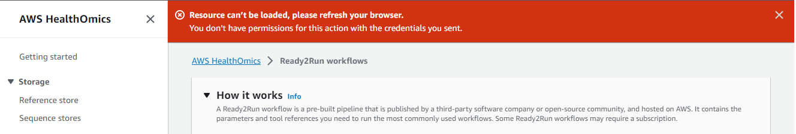
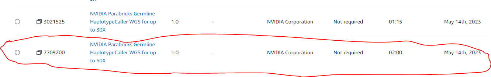

# User Permissions for AWS HealthOmics R2RWorkflows

The AWS HealthOmics service offers Ready2Run Workflows, or pre-built pipelines, to run the common Bioinformatics pipelines. 

## Problem Statement
- We have been prototyping Ready2Run workflows using accounts with AdministratorAccess.
- We will not have AdministratorAccess in production and need to run the workflows with a more restricted IAM Policy  
- We have setup a test account with the [IAM Policy described in the HealthOmics documentation](https://docs.aws.amazon.com/omics/latest/dev/permissions-user.html)
- We are getting errors both in the console and when we try to run the R2R workflows under the test account

## Error Messages

### Console Error Messages

When the test account user logs into the AWS Console and goes to the HealthOmics service they see the following error message:

At the top of the page you will see a "Resource can't be loaded" error.  I'm not sure what causes this but it does not seem to impact the ability to run the workflows.

### Workflow Error Messages

Under the test account we are trying to run the "NVIDIA Parabricks Germline HaplotypeCaller WGS for up to 50X" workflow. 

 When we try to run the workflow we get the following error message: