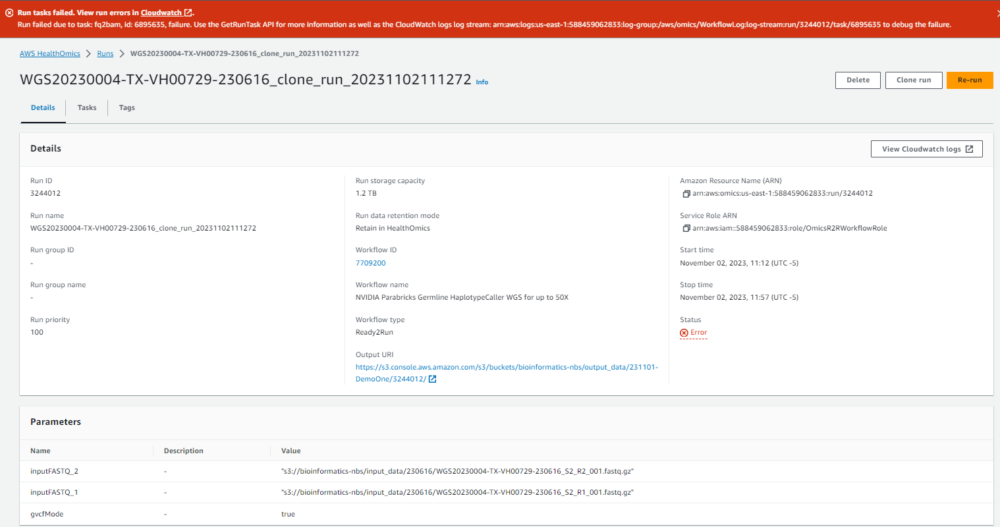
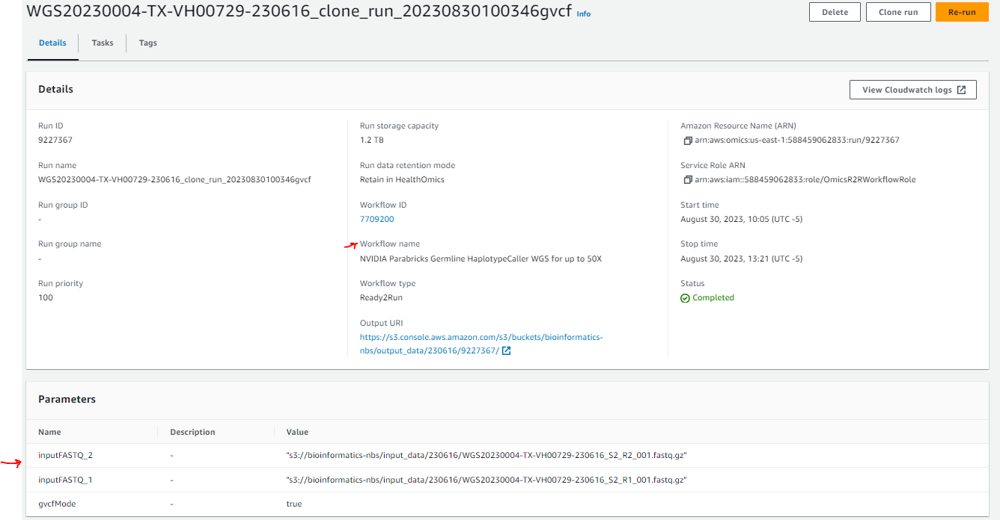

# AWS HealthOmics R2RWorkflows fail to run 

## Problem Statement 

- We have been using the NVIDIA Parabricks Germline HaplotypeCaller WGS for up to 50X(7709200) Ready2Run workflow to run our Bioinformatics pipelines
- These workflows ran with the same account permissions, and the same data, in August 2023
- These workflow no longer run

## What are the error messages?

Here is the console error message:



The Cloudwatch logs are:

```
--------------------------------------------------------------------------------------------------------------------------------------------------------------------------------------------------------------------------
|   timestamp   |                                                                                                message                                                                                                 |
|---------------|--------------------------------------------------------------------------------------------------------------------------------------------------------------------------------------------------------|
| 1698941576852 | {"runStatus":"PENDING","logMessage":"CREATING_RUN","message":"Creating your workflow run."}                                                                                                            |
| 1698941578378 | {"runStatus":"STARTING","logMessage":"STARTING_RUN","message":"Provisioning infrastructure for your workflow run."}                                                                                    |
| 1698941946225 | {"runStatus":"STARTING","logMessage":"SET_WORKFLOW_TIMEOUT","message":"Your workflow will be timed out after: 1200 minutes."}                                                                          |
| 1698942197253 | {"runStatus":"RUNNING","logMessage":"RUNNING_WORKFLOW","message":"Your workflow is now running."}                                                                                                      |
| 1698942264815 | {"runStatus":"RUNNING","logMessage":"IMPORTING_FILES","message":"Importing your workflow run input: s3://omics-us-east-1/Homo_sapiens_assembly38.fasta.tar"}                                           |
| 1698942319865 | {"runStatus":"RUNNING","logMessage":"IMPORTING_FILES","message":"Importing your workflow run input: s3://bioinformatics-nbs/input_data/230616/WGS20230004-TX-VH00729-230616_S2_R1_001.fastq.gz"}       |
| 1698942329731 | {"runStatus":"RUNNING","logMessage":"IMPORTING_FILES","message":"Importing your workflow run input: s3://bioinformatics-nbs/input_data/230616/WGS20230004-TX-VH00729-230616_S2_R2_001.fastq.gz"}       |
| 1698942585206 | {"runStatus":"RUNNING","logMessage":"IMPORT_COMPLETED","message":"Completed import of workflow run input: s3://omics-us-east-1/Homo_sapiens_assembly38.fasta.tar"}                                     |
| 1698943042181 | {"runStatus":"RUNNING","logMessage":"IMPORT_COMPLETED","message":"Completed import of workflow run input: s3://bioinformatics-nbs/input_data/230616/WGS20230004-TX-VH00729-230616_S2_R1_001.fastq.gz"} |
| 1698943078287 | {"runStatus":"RUNNING","logMessage":"IMPORT_COMPLETED","message":"Completed import of workflow run input: s3://bioinformatics-nbs/input_data/230616/WGS20230004-TX-VH00729-230616_S2_R2_001.fastq.gz"} |
| 1698943139216 | {"runStatus":"RUNNING","logMessage":"STARTING_TASK","message":"Starting workflow run task with name: fq2bam and taskId: 6895635"}                                                                      |
| 1698943806554 | {"runStatus":"RUNNING","logMessage":"RUNNING_TASK","message":"Running workflow run task: name: fq2bam and taskId: 6895635"}                                                                            |
| 1698943894588 | {"runStatus":"RUNNING","logMessage":"TASK_FAILED","message":"Workflow run task: name: fq2bam and taskId: 6895635 failed."}                                                                             |
| 1698943918330 | {"runStatus":"STOPPING","logMessage":"STOPPING_RUN","message":"Deprovisioning infrastructure for your workflow run."}                                                                                  |
| 1698943919296 | {"runStatus":"STOPPING","logMessage":"MAX_FILE_SYSTEM_USAGE","message":"Max file system usage (Size, Used, Used %): 1200GiB 170GiB 14%"}                                                               |
| 1698943921649 | {"runStatus":"STOPPING","logMessage":"ENGINE_LOG_GENERATED","message":"Engine log stream: arn:aws:logs:us-east-1:588459062833:log-group:/aws/omics/WorkflowLog:log-stream:run/3244012/engine"}         |
| 1698944225861 | {"runStatus":"FAILED","logMessage":"RUN_FAILED","message":"Workflow run failed."}                                                                                                                      |
--------------------------------------------------------------------------------------------------------------------------------------------------------------------------------------------------------------------------

```

The error is the fq2bam task failed.  

```
2023-11-02T11:51:34.588-05:00
{
    "runStatus": "RUNNING",
    "logMessage": "TASK_FAILED",
    "message": "Workflow run task: name: fq2bam and taskId: 6895635 failed."
}
```

## What are possible causes?

- The Genomics data is corrupted.  
  
  This is unlikely because the same data ran in August 2023
  

  I also ran the same workflow with the Omics sample data: 
  ```
   s3://omics-us-east-1/sample-inputs/7709200/HG002-NA24385-pFDA_S2_L002_R2_001-5x.fastq.gz
   s3://omics-us-east-1/sample-inputs/7709200/HG002-NA24385-pFDA_S2_L002_R1_001-5x.fastq.gz
  ```

- Service role Permissions have changed
  This is unlikely because the same Omics Service role(OmicsR2RworkflowRole) was used in both cases

- [Omics Quota](https://us-east-1.console.aws.amazon.com/servicequotas/home/services/omics/quotas) limits have been reached

  This is unlikely because the Omics Quota limits are 1000 runs per account per region per month.  We have only run 5 workflows in this account in November 2023.

- The NVIDIA FASTQ to BAM task is not working

  This is possible.  The fq2bam task is a custom task that is not part of the Omics service.  It is a task that is provided by NVIDIA.  It is possible that NVIDIA has changed the task and it is no longer compatible with the Omics service.  

  What evidence do we have that this is the case?

  When I ran the NVIDIA Parabricks FQ2BAM WGS for up to 50x(8211545) workflow with our data and I get the same error message 
  
