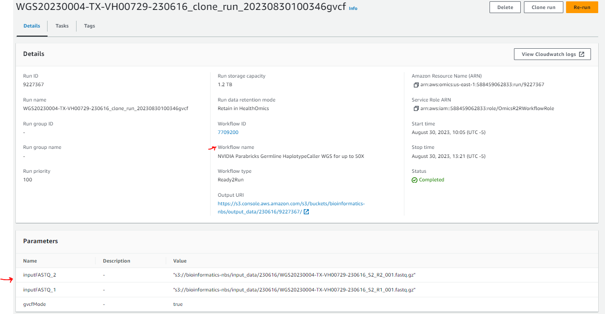

# AWS HealthOmics R2RWorkflows fail to run

## Problem Statement

- We have been using Ready2Run Workflows
- We primarily using the NVIDIA Parabricks Germline HaplotypeCaller WGS for up to 50X(7709200), and the NVIDIA Parabricks Germline HaplotypeCaller WGS for up to 30X(4974161).
- These workflows ran with the same account permissions, and the same data, in August 2023
- These workflow no longer run

## What are the error messages?


When I View the Cloudwatch logs I get the following:

```
--------------------------------------------------------------------------------------------------------------------------------------------------------------------------------------------------------------------------
|   timestamp   |                                                                                                message                                                                                                 |
|---------------|--------------------------------------------------------------------------------------------------------------------------------------------------------------------------------------------------------|
| 1698941576852 | {"runStatus":"PENDING","logMessage":"CREATING_RUN","message":"Creating your workflow run."}                                                                                                            |
| 1698941578378 | {"runStatus":"STARTING","logMessage":"STARTING_RUN","message":"Provisioning infrastructure for your workflow run."}                                                                                    |
| 1698941946225 | {"runStatus":"STARTING","logMessage":"SET_WORKFLOW_TIMEOUT","message":"Your workflow will be timed out after: 1200 minutes."}                                                                          |
| 1698942197253 | {"runStatus":"RUNNING","logMessage":"RUNNING_WORKFLOW","message":"Your workflow is now running."}                                                                                                      |
| 1698942264815 | {"runStatus":"RUNNING","logMessage":"IMPORTING_FILES","message":"Importing your workflow run input: s3://omics-us-east-1/Homo_sapiens_assembly38.fasta.tar"}                                           |
| 1698942319865 | {"runStatus":"RUNNING","logMessage":"IMPORTING_FILES","message":"Importing your workflow run input: s3://bioinformatics-nbs/input_data/230616/WGS20230004-TX-VH00729-230616_S2_R1_001.fastq.gz"}       |
| 1698942329731 | {"runStatus":"RUNNING","logMessage":"IMPORTING_FILES","message":"Importing your workflow run input: s3://bioinformatics-nbs/input_data/230616/WGS20230004-TX-VH00729-230616_S2_R2_001.fastq.gz"}       |
| 1698942585206 | {"runStatus":"RUNNING","logMessage":"IMPORT_COMPLETED","message":"Completed import of workflow run input: s3://omics-us-east-1/Homo_sapiens_assembly38.fasta.tar"}                                     |
| 1698943042181 | {"runStatus":"RUNNING","logMessage":"IMPORT_COMPLETED","message":"Completed import of workflow run input: s3://bioinformatics-nbs/input_data/230616/WGS20230004-TX-VH00729-230616_S2_R1_001.fastq.gz"} |
| 1698943078287 | {"runStatus":"RUNNING","logMessage":"IMPORT_COMPLETED","message":"Completed import of workflow run input: s3://bioinformatics-nbs/input_data/230616/WGS20230004-TX-VH00729-230616_S2_R2_001.fastq.gz"} |
| 1698943139216 | {"runStatus":"RUNNING","logMessage":"STARTING_TASK","message":"Starting workflow run task with name: fq2bam and taskId: 6895635"}                                                                      |
| 1698943806554 | {"runStatus":"RUNNING","logMessage":"RUNNING_TASK","message":"Running workflow run task: name: fq2bam and taskId: 6895635"}                                                                            |
| 1698943894588 | {"runStatus":"RUNNING","logMessage":"TASK_FAILED","message":"Workflow run task: name: fq2bam and taskId: 6895635 failed."}                                                                             |
| 1698943918330 | {"runStatus":"STOPPING","logMessage":"STOPPING_RUN","message":"Deprovisioning infrastructure for your workflow run."}                                                                                  |
| 1698943919296 | {"runStatus":"STOPPING","logMessage":"MAX_FILE_SYSTEM_USAGE","message":"Max file system usage (Size, Used, Used %): 1200GiB 170GiB 14%"}                                                               |
| 1698943921649 | {"runStatus":"STOPPING","logMessage":"ENGINE_LOG_GENERATED","message":"Engine log stream: arn:aws:logs:us-east-1:588459062833:log-group:/aws/omics/WorkflowLog:log-stream:run/3244012/engine"}         |
| 1698944225861 | {"runStatus":"FAILED","logMessage":"RUN_FAILED","message":"Workflow run failed."}                                                                                                                      |
--------------------------------------------------------------------------------------------------------------------------------------------------------------------------------------------------------------------------

```


From the logs it appears that the fq2bam task failed.  

```
2023-11-02T11:51:34.588-05:00
{
    "runStatus": "RUNNING",
    "logMessage": "TASK_FAILED",
    "message": "Workflow run task: name: fq2bam and taskId: 6895635 failed."
}
```

## What are possible causes?

- The Genomics data is corrupted.  
  This is unlikely because the same data ran in August 2023

  

- Permissions have changed

- Omics Quota limits have been reached