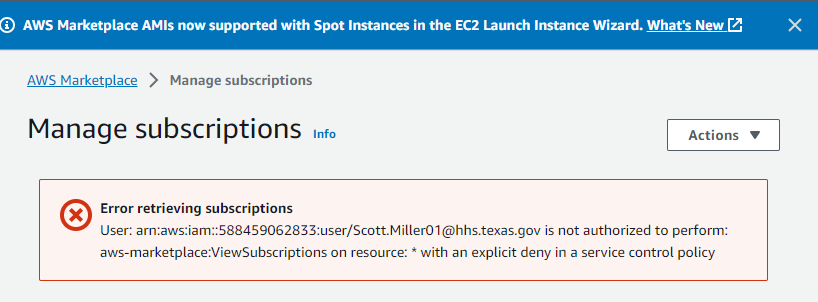

# Deploying Cisco Catalyst 8000V for SD-WAN & Routing to AWS

## Problem Statement
-	The [AWS Marketplace has the Cisco Catalyst 8000v software](https://aws.amazon.com/marketplace/pp/prodview-rohvq2cjd4ccg) which allows you to create a EC2 instance with the Cisco 8000V software installed
-	The [Cisco documentation for AWS](https://www.cisco.com/c/en/us/td/docs/routers/C8000V/AWS/deploying-c8000v-on-amazon-web-services/overview.html) says to use the image from the AWS Marketplace
-	Texas Division of Information Resources does not allow us to get software from the AWS Marketplace. 

    

# Here are the workarounds I have tried

## Move a AMI from my AWS personal account to my work account

Steps:

On my personal AWS account :

 Create a AMI from the Cisco 8000V image in the AWS Marketplace.
 1. Build a EC2 image from the Cisco 8000V image in the AWS Marketplace **(Success!)**:smiley:
 2. Create a private AMI from the EC2   **(Success!)**:smiley:
 3. Provide access to my AMI in my personal account to my work account **(Success!)**:smiley:

On my work AWS account:

Move the AMI from my personal account to my work account **(Fail!)**:disappointed:
 ```
aws ec2 copy-image --source-image-id "ami-0af0d29e399b3acc1" --source-region us-east-1 --region us-east-1 --name "Cisco Catalyst 8000V AMI" --output text
An error occurred (InvalidRequest) when calling the CopyImage operation: Images from AWS Marketplace cannot be copied to another AWS account.
 ``` 


If any AMI is created from an original AWS Marketplace AMI's it cannot be copied to another account. This is a restriction of the AWS Marketplace licensing. My guess is somethings gets embedded in all AMI's created from the AWS Marketplace original which enforces this restriction

## Create a AMI from the Cisco Catalyst 8000V software

We have licenses and access to the Cisco 8000V software. This workaround is to create the AMI from the Cisco 8000V software images using [AWS VM Import/Export](https://docs.aws.amazon.com/vm-import/latest/userguide/vmimport-image-import.html).

Steps:
1. Setup the [AWS infrastructure and permissions](./01-Build-AMI/) for VM Import/Export **(Success!)**:smiley:
2. Create the [scripts to import the Cisco 8000V image](./01-Build-AMI/scripts).  This Cisco software has images for ova, ovf, raw and vmdk formats.  I have container.json files for each one **(Success)**:smiley:
3. Try to import the Cisco 8000v image **(Fail!)**:disappointed:


 ```console
 # Command to import the image.  The only thing that changes is what is in containers.json
 aws ec2 import-image --architecture x86_64 --platform Linux --description "My Cisco 8000v" --license-type BYOL --disk-containers containers.json --output json 
  ```

Error messages:
| Cisco software file type            | Description                                                   |  import-image error                                            |
| --------------------------------| ------------------------------------------------------------- | -------------------------------------------------------------- |
| ova (file ext: .ova)            | Single distribution of the OVF file package                   |  "ClientError: No valid partitions. Not a valid volume."       |
| raw (file ext: .bin)            | Binary raw distribution                                       |  "ClientError: No valid partitions. Not a valid volume.        |
| iso (file ext: iso)             | Exact copy of the hard drive                                  |  Not supported by ec2 import-image                             |

I also tried to split the .ova file into the .vmdk and .ovf files and import them separately.  This also failed with the same error.

My current hypothesis is the .ovf file has a number of selectors that allow software like VMWare hypervisor to make selection as part of the build process.  I think the AWS ec2 import-image process is not able to handle these selectors.


