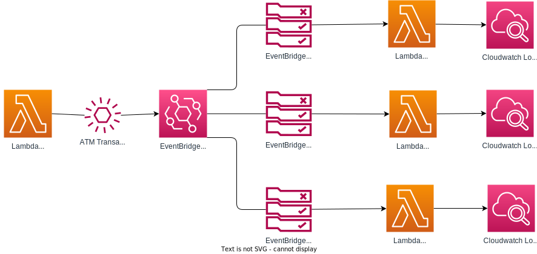

# AWS EventBridge Prototype
This prototype is based on the [sample application AWS EventBridge tutorial](https://docs.aws.amazon.com/eventbridge/latest/userguide/eb-tutorial-get-started.html).

This prototype simulates a ATM machine.  A Lambda function sends ATM transactions to the default EventBridge.  The rules in the EventBridge inspect the ATM transactions and determine which consumer Lambda function to invoke. The consumer Lambda functions then output the ATM transaction to their CloudWatch log. 



The Terraform creates:
- An event producer Lambda function written in Node that produces ATM transaction events
- 3 event consumer Lambda functions written in Node that consume ATM transaction events
- 3 rules on the default event bus that invoke one of the 3 consumer Lambda functions based on the ATM transaction type
- `scripts/variables.sh` which includes the name of the Producer Lambda function and is used for the `scripts/produce-events.sh` script


Once the Terraform is applied, you can produce events using the `./scripts/produce-events.sh` script.  The script will produce 3 events, one for each ATM transaction type.  The script will also print the event id for each event.


## Setup Prerequisites

- An AWS account 
- AWS CLI installed
- Terraform 5.0 or greater installed
- Node 14.17.0 or greater installed if you want to modify the Lambda functions


## Steps to use the prototype

1. Run the Terraform to create the infrastructure.
    ``` bash
    $ terraform init
    $ terraform apply
    ```
2. Run the event producer script to produce events.
    ``` bash

    $ cd scripts
    $ ./produce-events.zsh
    {
    "StatusCode": 200,
    "ExecutedVersion": "$LATEST"
    }
    ```


## Steps to run the event producer Lambda function locally

1. Install the pre-requisites to run the Node Lambda function locally
    ``` bash
    $ cd src/atmProducer
    $ npm install
    ```
2. Run the lambda function locally
    ``` bash
    $ node run-local.js
    ```

3. Cleanup the local node modules
    ``` bash
    $ rm -rf node_modules
    ```

## Steps to setup your own Lambda function that calls the EventBridge

1. Create a directory for your Lambda function
    ``` bash
    $ mkdir myLambdaFunction
    $ cd myLambdaFunction
    ```

2. Create a `package.json` file
    ``` bash
    $ npm init
    ``` 
3. Create a `index.js` file
    ``` bash
    $ touch index.js
    ```

4. Install the AWS EventBridge SDK
    ``` bash
    $ npm install @aws-sdk/client-eventbridge # installs the aws eventbridge sdk
    $npm install @aws-sdk/lib-dynamodb
    ```

