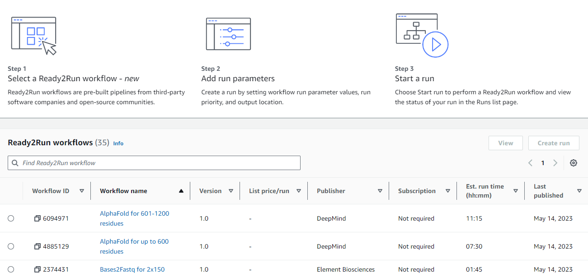
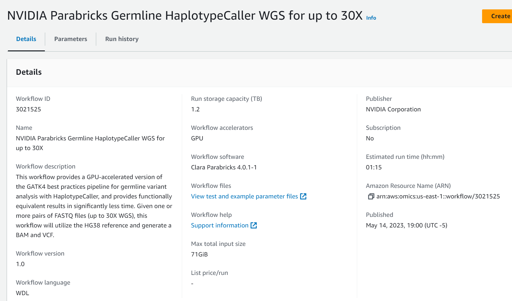

# AWS HealthOmics Workflows

AWS HealthOmics provides a set of pre-built workflows that can be used to analyze genomics data.  We have been using these workflow since they take existing Bioinformatics pipelines and optimize them.

All of the Ready2Run workflows are located in the AWS HealthOmics console. 

If you click on the Ready2Run workflows you get a searchable list of all Omics workflows

If you select and click on a workflow you will get a description of the workflow and a link to the documentation.

Workflows have a maximum input fixe size.  For example the "NVIDIA Parabricks Germline HaplotypeCaller WGS for up to 30X" workflow has a maximum input file size of 71GB.  That size is calculated by combining the size of the FASTQ input files.  If your input filles are larger than the maximum size you should consider using the "NVIDIA Parabricks Germline HaplotypeCaller WGS for up to 50X" workflow which has a maximum input file size of 137GB.  

Each workflow has a set of Workflow files.  These files are used to test the workflow.

One thing to note is that the workflows are not free.  You are charged for the compute and storage resources used by the workflow.  You can see the pricing for each workflow by clicking on the "Pricing" link in the left menu.  You can use the demo account to run any workflow you want but be aware there is a cost associated with running the workflows.

