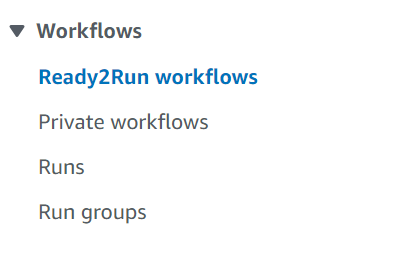

# AWS HealthOmics Workflows

This is a list of Bioinformatics sample data files that can be used to test the AWS HealthOmics Ready2Run workflows.

## Sample Data 
All of our FASTQ sample data is located in the `bioinformatics-nbs` S3 bucket. The table below gives the full S3 URL for t. The S3 URL can be used in the AWS HealthOmics Ready2Run workflow form.

| FASTQ Pair      | Size (GB)   | S3 URL   |
| -------- | ------- |-------| 
| Small    | 17 GB   | `s3://bioinformatics-nbs/input_data/230616/WGS20230010-TX-VH00729-230616_S3_R1_001.fastq.gz`    |
| Small    | 18.1 GB    | `s3://bioinformatics-nbs/input_data/230616/WGS20230010-TX-VH00729-230616_S3_R2_001.fastq.gz`    |
| Medium    | 39.1 GB    | `s3://bioinformatics-nbs/input_data/230616/WGS20230004-TX-VH00729-230616_S2_R1_001.fastq.gz`    |
| Medium    | 41.2 GB    | `s3://bioinformatics-nbs/input_data/230616/WGS20230004-TX-VH00729-230616_S2_R2_001.fastq.gz`    |
| Large    | 44.5 GB    | `s3://bioinformatics-nbs/input_data/230616/WGS20230002-TX-VH00729-230616_S1_R1_001.fastq.gz`    |
| Large    | 47.5 GB    | `s3://bioinformatics-nbs/input_data/230616/WGS20230002-TX-VH00729-230616_S1_R2_001.fastq.gz`    |

## Ready2Run Workflows

All of the Ready2Run workflows are located in the AWS HealthOmics console. 

If you click on a workflow you get details about it. 

Sample Data for HaplotypeCaller WGS for up to 50x(7709200)

The json files has the following:
{
    "inputFASTQ_1": "s3://omics-<region>/sample-inputs/7709200/HG002-NA24385-pFDA_S2_L002_R1_001-50x.fastq.gz",
    "inputFASTQ_2": "s3://omics-<region>/sample-inputs/7709200/HG002-NA24385-pFDA_S2_L002_R2_001-50x.fastq.gz"
}

