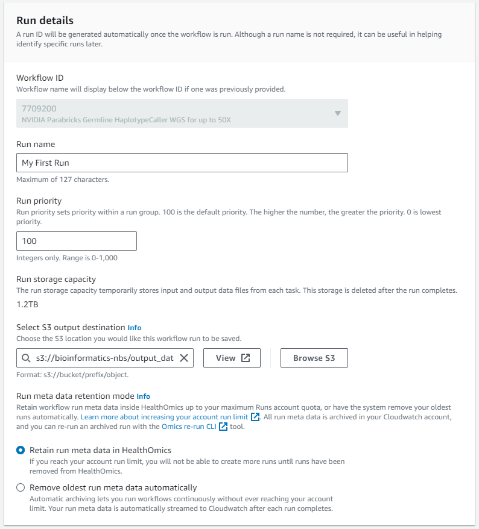
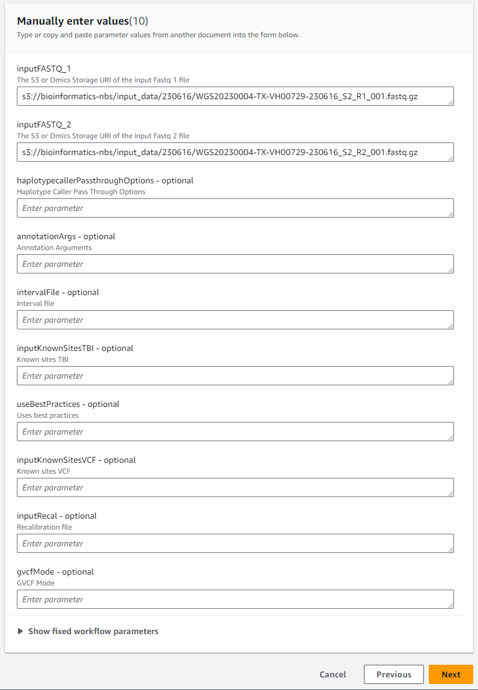
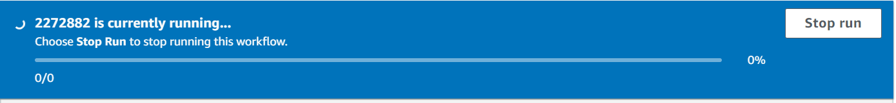
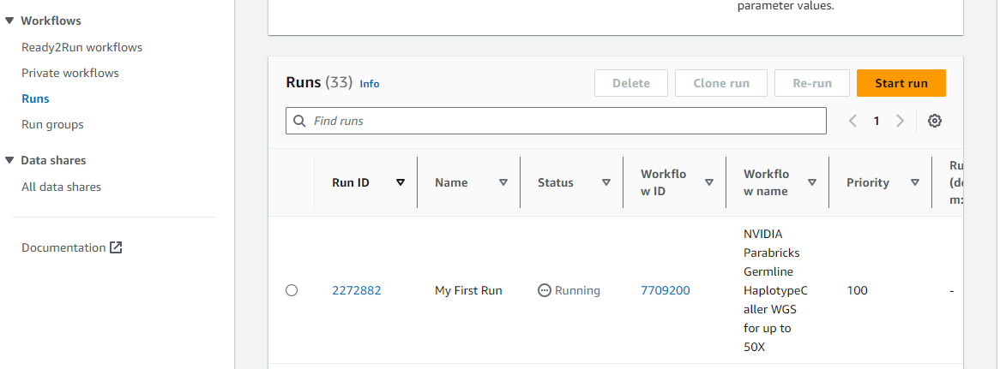

# Getting Started with a AWS HealthOmics Ready2Run Workflow

## Prerequisites

Access to the AWS sandbox environment. You should have been been sent two emails
- The first is your account name and explains how to login to the AWS sandbox account 
- The second is your temporary password.  The first time you login you will have to change your password.  

## Steps to us a AWS HealthOmics Ready2Run Workflows

1. Login to the AWS Console
    - Go to https://console.aws.amazon.com/console/home?region=us-east-1
    - Select IAM user
    - Enter in the sandbox account number of 588459062833

2. Type your username and password
    - If this is the first time logging in you will be asked to change your password

3. Once logged in verify you are in the N. Virginia region.  
    - In the top right of your browser you should see this:
. 
    - If you see another region change the region to be US-East (N. Virginia)

4. Go to the S3 buckets
    - In the search box type "S3" and select "S3" from the list
    - You should see a list of S3 buckets. . 
    - The **bioinformatics-nbs** bucket is where our the HealthOmics data is stored.  If you upload any data store it here. You have full access rights to this directory.

5. Go to AWS HealthOmics
    - In the search box type "omics" and select "AWS HealthOmics" 
    - In the left menu select Ready2Run workflows
    

6. Find the "NVIDIA Parabricks Germline HaplotypeCaller WGS for up to 50X" Ready2Run workflow 
    - In the Ready2Run workflows search box type "7709"
    
    - Select the workflow and click the "Create run" button

7. Run the "NVIDIA Parabricks Germline HaplotypeCaller WGS for up to 50X"  workflow 
    - Give the Run a name (e.g. My First Run)
    - Set the output folder to be s3://bioinformatics-nbs/output_data/231201
    
  
    - For the Service role select OmicsWorkflowServiceRole and click next 
    
    - Keep the default of Manually enter values
  
 
    - Use the following FASTQ files:
        `s3://bioinformatics-nbs/input_data/230616/WGS20230004-TX-VH00729-230616_S2_R1_001.fastq.gz`
        `s3://bioinformatics-nbs/input_data/230616/WGS20230004-TX-VH00729-230616_S2_R2_001.fastq.gz`

        
        - Click the "Next" button        

    - At the bottom of the next page click the "Start run" button
        

8. Monitor the run
    - After you click the "Start run" button you will see a banner at the top of the page 
    
    - You can also see the run status of all "Runs" by clicking the "Runs" link in the left menu
    