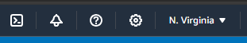
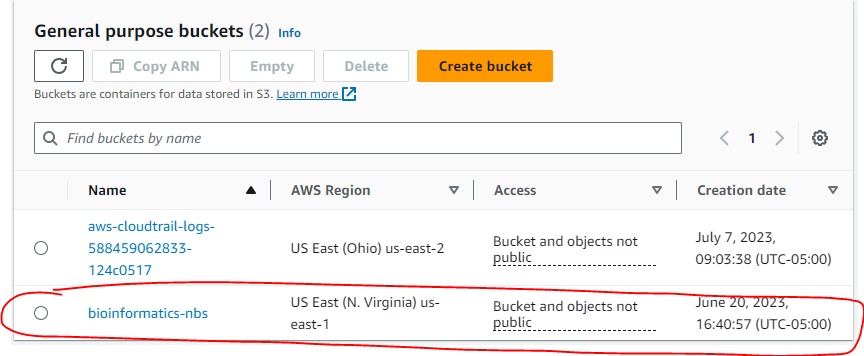
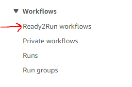
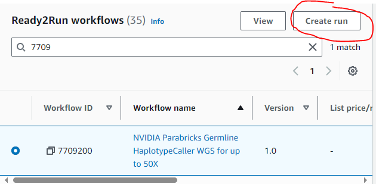
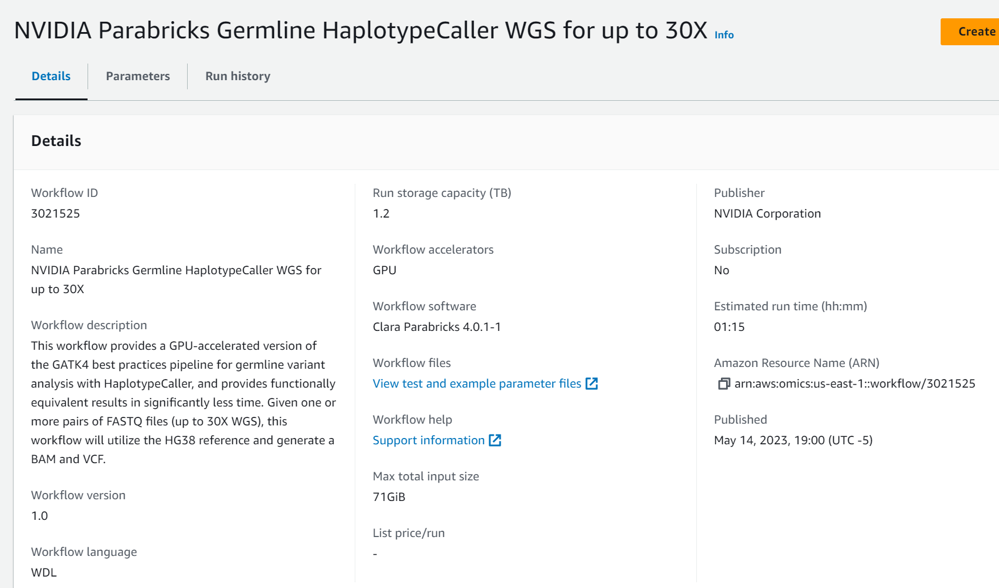

# Steps to run a AWS HealthOmics Ready2Run Workflow

## Prerequisites

An AWS Sandbox Account
You should have been been sent two emails from me 
- The first is your account name and explains how to login to the AWS sandbox account 
- The second is your temporary password.  The first time you login you will have to change your password.  

## Steps to us a AWS HealthOmics Ready2Run Workflows

1. Login to the [AWS Console](https://588459062833.aws.signin.amazon.com/console)

2. Type in your username and password
    - If this is the first time logging in you will be asked to change your password

3. Once logged in verify you are in the N. Virginia region.  
    - In the top right of your browser you should see this:
. 
    - If not select the arrow and change the region to be US-East (N. Virginia)

4. Go to the S3 buckets
    - In the search box type "S3" and select "S3" from the list
    - You should see a list of S3 buckets. . 
    - The **bioinformatics-nbs** bucket is where our data is stored.  If you upload any data store it here.

5. Go to AWS HealthOmics
    - In the search box type "omics" and select "AWS HealthOmics" 
    - In the left menu select Ready2Run workflows
    

6. Find the "NVIDIA Parabricks Germline HaplotypeCaller WGS for up to 50X" Ready2Run workflow 
    - In the Ready2Run workflows search box type "7709"
    
    - Select 7709200 and click the "Create run" button

7. Run the "NVIDIA Parabricks Germline HaplotypeCaller WGS for up to 50X" Ready2Run workflow 
    - Give the Run a name (e.g. My First Run)
    - Click the "Browse S3" button and select this output folder 
      s3://bioinformatics-nbs/output_data/231201
    - Keep the other defaults
    
    

-

