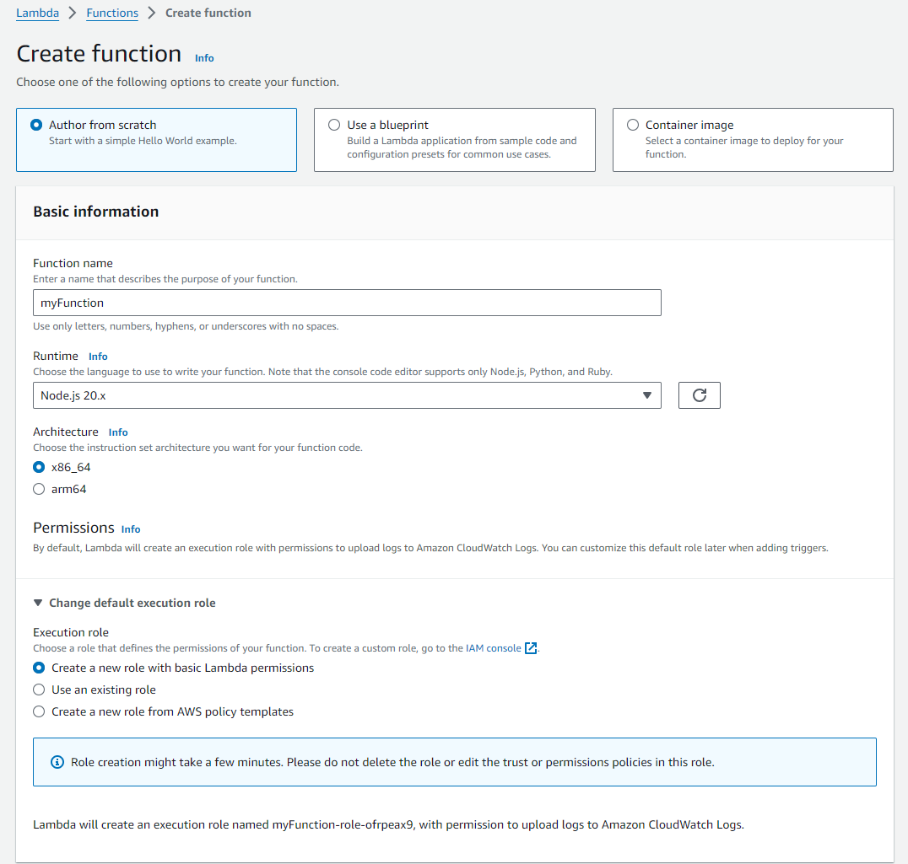
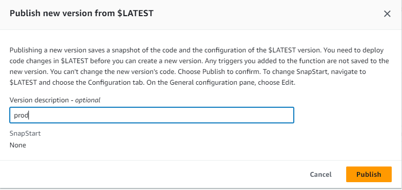
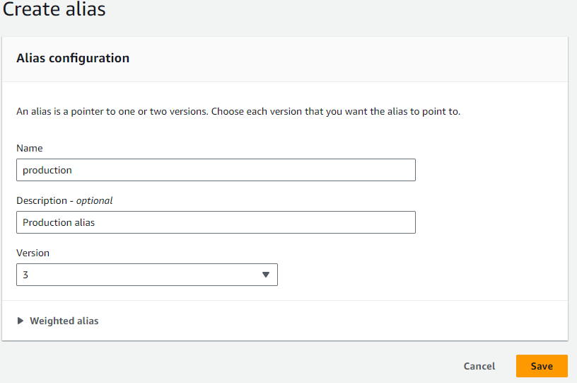
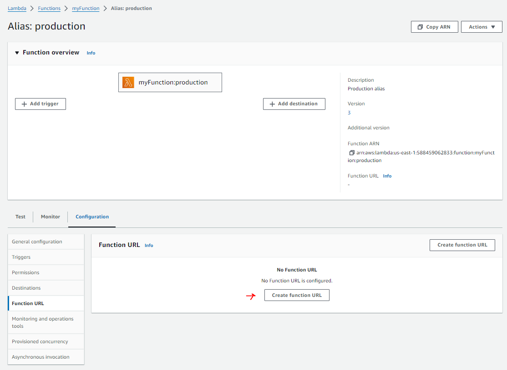
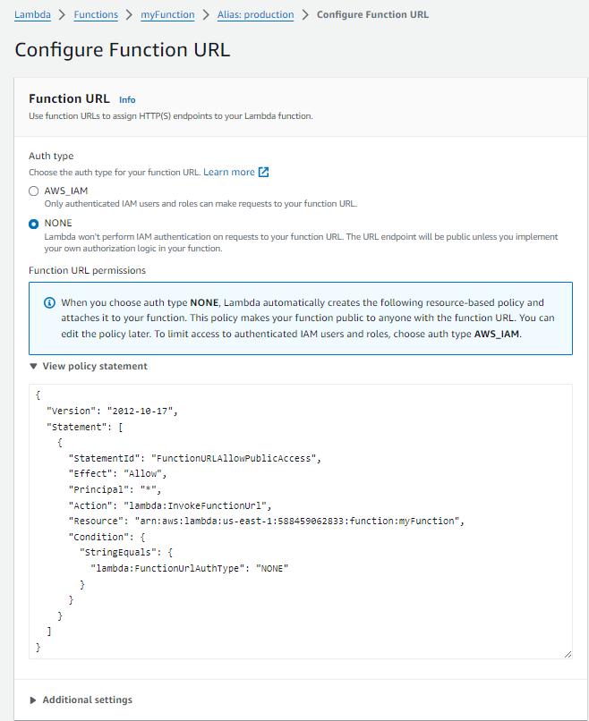
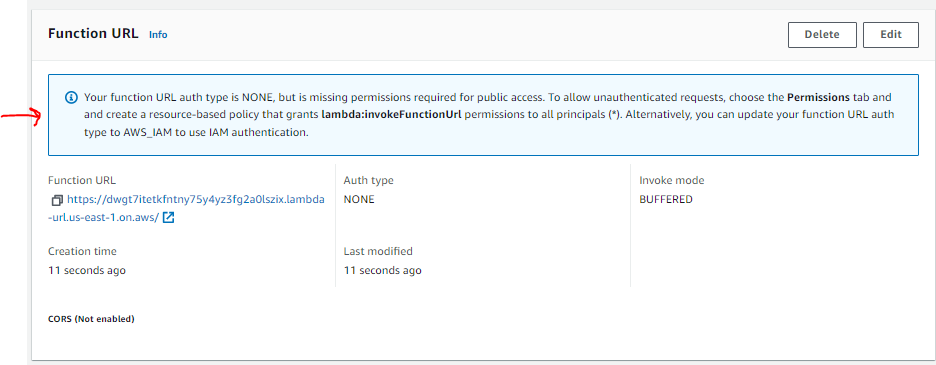
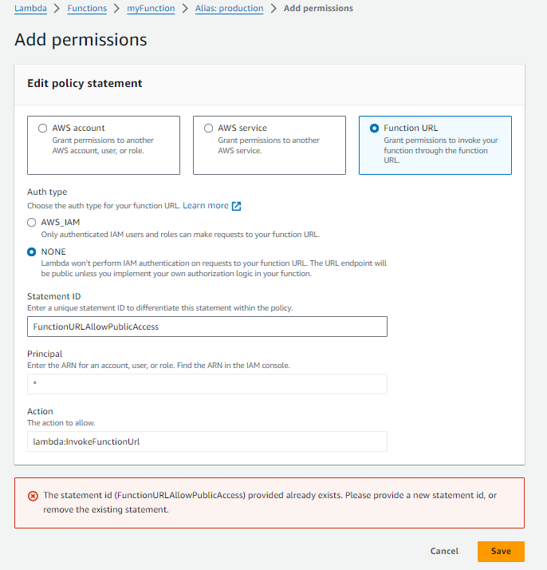
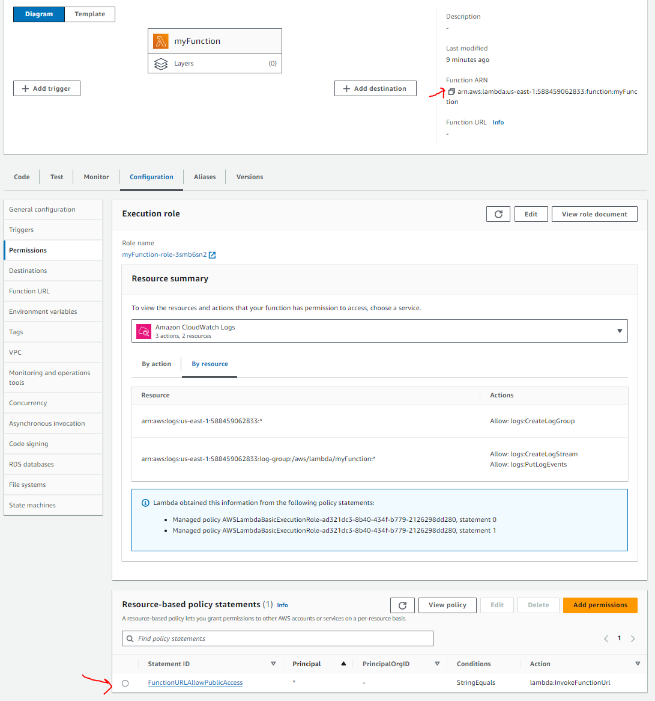

# Lambda Alias Function URL Permission Issue

## Problem

In the AWS Console if I create a Lambda function, publish a version, create an alias to the version, and then create a function URL with None as the Authentication I get an error message when I try to access the function URL. 

## Steps to reproduce:

1. Create a new lambda function
  

2. Modify the lambda function to output something different
    ``` node
    export const handler = async (event) => {
    // TODO implement
    const response = {
      statusCode: 200,
      body: JSON.stringify('Hello from Version 1 of my Lambda!'),
    };
    return response;
    };
    ```

3. Deploy the lambda function
4. Test it. You should see
  ``` json
  {
    "statusCode": 200,
    "body": "\"Hello from Version 1 of my Lambda!\""
  }
  ```
5. Publish a version of the lambda function
  

6. Create an alias to the new version. Select the only version available. 
  

7. Create a Function URL for the Alias
  

8. Select the Auth type to NONE and create the URL
  


   You get a message that you must allow lambda:invokeFunctionUrl permissions to all principles(*)
 
  

9. Test the function URL.  You will see a error:
  ``` json
  {
      "Message": "Forbidden"
  }
  ```

  Ok so let's give it the correct permission. 

10. Go to the alias permission tab select Add Permissions 
  


11. Select Add Permissions
  
  You will see an error message that says "The statement id (FunctionURLAllowPublicAccess) provided already exits.  Please provide a new statement id, or remove the existing statement"
  If I change the Statement ID to a different name I can save it. But when I try to test the function URL I get the same error message. 
  ``` json
  {
    "Message": "Forbidden"
  }
  ```


## What is happening?


The issue is that the lambda function, not the alias, gets the resource based policy attached. 

To verify:

1. Go to the lambda function and select the Permissions tab
  

  Notice that the FunctionURLAllowPublicAccess policy is attached to the lambda function, not the alias.  This is why you get the error message when you try to add the same policy to the alias.  The policy is added to the Lambda function not the alias.

2. If you view the policy you will see that it is attached to the lambda function not the alias
  ``` json  
  {
    "Version": "2012-10-17",
    "Id": "default",
    "Statement": [
      {
       "Sid": "FunctionURLAllowPublicAccess",
        "Effect": "Allow",
       "Principal": "*",
       "Action": "lambda:InvokeFunctionUrl",
        "Resource": "arn:aws:lambda:us-east-1:588459062833:function:myFunction",
       "Condition": {
          "StringEquals": {
            "lambda:FunctionUrlAuthType": "NONE"
         }
        }
      }
    ]
  }
  ```

The policy line `arn:aws:lambda:us-east-1:588459062833:function:myFunction` is the arn to the lambda function, not the alias.  The alias Function arn is `arn:aws:lambda:us-east-1:588459062833:function:myFunction:production`

I can't find a way in the console to add the policy to the alias.  I can only add it to the lambda function.  

## Why is the happening?

I don't know.  I have a few ideas:
1) I have to use the CLI to give permission to the alias.  I can't do it in the console.
2) There is a bug in the console.  It should allow me to add the policy to the alias.
3) Something else?


