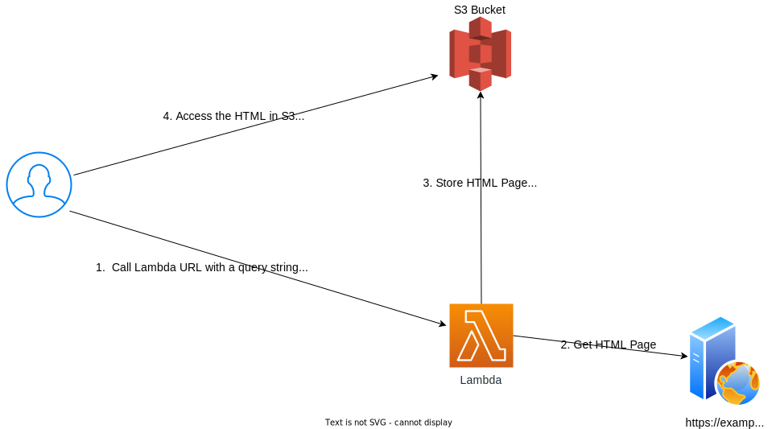

# AWS Lambda Prototype



This prototype uses Terraform to build the infrastructure and deploy a Lambda function.  You call the Lambda function through a public URL and pass it input parameters. The Lambda function gets the HTML from a URL you provided and stores the HTML in a S3 bucket.  The lambda function is a Node.js function written in Typescript.

The prototype consists of:
- Terraform to build the infrastructure and deploy the Lambda function
- A Lambda function that gets the HTML from a URL and stores it in a S3 bucket
- Helper tools:
    - [Lambda-build](https://github.com/alexkrkn/lambda-build) to build the Typescript code using esbuild and deploy it to AWS
    - [Mocha](https://mochajs.org/) for Javascript unit tests
- A GitHub action to deploy the Lambda function whenever there is a change in the Lambda src code directory


The Lambda function came from this [YouTube video](https://www.youtube.com/watch?v=51EAwBDdgio). The video is a great introduction to Lambda development, testing, and deployment using Node and TypeScript.  I highly recommend it.

If you want to learn how to build, test and deploy the Lambda function from scratch you can watch the video or use my [step-by-step instructions](BuildLambdaFromScratch.md).


## Terraform

The Terraform builds the infrastructure for the Lambda function and deploys the first version of the Lambda function.

The Terraform creates:
- A Lambda function called `lambda-url-to-html` that 
    - Has permission to write to the S3 bucket
    - Has a timeout of 20 seconds
    - Will use the package in ./src/deploy/latest.zip to deploy the Lambda function
- Two lambda aliases called live and test.  Each alias with each have a different function urls to access the function
- A S3 bucket called `storage-for-lambda-url-to-html`.  The S3 bucket permissions allow public read access to all objects in the bucket
- The `./scripts/variables.sh` file.  The file contains variables used by the shell scripts


## Setup Prerequisites

- An AWS account 

It is highly recommended you use the [Visual Studio Code DevContainer](https://code.visualstudio.com/docs/devcontainers/containers) at the root of this repository.  The instructions below assume you are using the DevContainer.  If you don use the DevContainer you will need to install the following:

- AWS CLI installed and configure for your account
- Terraform 5.0 or greater installed
- Node.js 20.10.0 or greater installed

    

## Steps to build and verify the AWS Infrastructure

By default the Terraform will create the infrastructure in the us-east-1 region.  To use a different region, edit the variable.tf file and change the region variable.

1. Configure the AWS CLI
    ``` bash
    $ aws configure
    AWS Access Key ID [None]: <your access key>
    AWS Secret Access Key [None]: <your secret key>
    Default region name [None]: us-east-1
    Default output format [None]: json
    ```
2. Run the Terraform to create the infrastructure.
    ``` bash
    $ terraform init
    $ terraform apply
    ```
3. Run the `scripts/test-live.zsh` script to test the live alias.  The script will run the lambda function using the live alias.  The live alias is configured to use the latest version of the lambda function.  
    ``` bash
    $ cd ./scripts
    $ ./test_live.zsh
   Success! Response matches the expected value
    Here is the response: {"title":"Hacker News","s3_url":"https://storage-for-lambda-url-to-html.s3.amazonaws.com/hackernews.html"}
    Success! Response matches the expected value
    Here is the response: {"title":"Hacker News","s3_url":"https://storage-for-lambda-url-to-html.s3.amazonaws.com/undefined.html"}
    ```
    
3. Open the link to the S3 bucket in the browser to see the HTML file that was created by the lambda function.
    Go to  `https://storage-for-lambda-url-to-html.s3.amazonaws.com/hackernews.html` in a browser

You are done.

## Deployment Options

The next sections explain how to deploy the Lambda function using different methods.  You only need to do one of the deployment options. 


### Deploy the Lambda function using Terraform (Optional)

These steps explain how to create a package that is used by Terraform to deploy the Lambda
function.

1. Run a shell script to package the lambda function 
The script will create a new latest.zip file in the src/deploy directory.  This is the zip file used by Terraform when it deploys the lambda function.
    ``` bash
    $ cd ./scripts
    $./package-latest.zsh 
    added 266 packages, and audited 267 packages in 2s

    36 packages are looking for funding
    run `npm fund` for details

    found 0 vulnerabilities

    > lambda-url-to-html@1.0.0 build
    > lambda-build archive -e index.ts
    ⚡️ Bundling index.ts
    ✔ Created archive.zip 2.39 MB

    Success! You can find the latest lambda package in ../src/deploy/latest.zip 
    ```

2. When you deploy again using Terraform, it will use the latest.zip file in the src/deploy directory to deploy the lambda function.  

### Deploy the Lambda function using a lambda-build (Optional)

These steps explain how to create use lambda-build lambda to deploy the Lambda to AWS

1. If you Lambda function is not in us-east-1 change the region in package.json
   Open `src/package.json`.  Change the the us-east-1 to the region of your lambda function.  
    ``` json
     "deploy": "lambda-build upload -r us-east-1 lambda-url-to-html",
    ``` 
2. Run `npm install` to install the dependencies
    ``` bash
    $ cd ./src
    $ npm install
    added 266 packages, and audited 267 packages in 1s

    36 packages are looking for funding
    run `npm fund` for details

    found 0 vulnerabilities
    ```
3. Deploy the function to AWS
    ``` bash
    $ npm run deploy

    > lambda-url-to-html@1.0.0 deploy
    > lambda-build upload -r us-east-1 lambda-url-to-html


 ⚡️ Bundling & Uploading ./index.js|ts
  → Bundle archived 2.39 MB
  → Using region us-east-1
  → Uploading lambda-url-to-html
  ✔ Successfully uploaded lambda-url-to-html
  ✔ Successfully uploaded 1 function(s)
    ```

Success! You have built and uploaded your Lambda function to AWS.

### Deploy the Lambda function using a GitHub action (Optional)

These steps explain how to use a GitHub action to deploy the Lambda to AWS whenever you check in a change to the src directory in GitHub.  The GitHub action will 
- Build the Lambda function.
- Run the unit tests
- Deploy the Lambda function to AWS

1. Open GitHub
2. Go to the Settings page for your Repo
3. Under Secrets and Variables create two Secrets called AWS_ACCESS_KEY_ID with the value of your AWS access key and AWS_SECRET_ACCESS_KEY with the value of your AWS secret key

4. Make a directory called .github/workflows at the root of your repository
5. Copy the github/workflows/deploy.yml to the .github/workflows directory
6. Make a change to any file in the src directory and check it in.  

The GitHub action will run and deploy the Lambda function to AWS.  You can see the results of the GitHub action by going to the Actions tab in GitHub.


## Steps the to change the live alias (Optional)

The Terraform creates two Lambda aliases.  They are:
- live:  The live alias is configured to use the "live" or production version of the Lambda function. 
- latest: The latest alias is configured to use the latest version of the Lambda function. 

These steps simulate a deployment where the Lambda live alias points to an old version of the lambda and the latest alias points to the version of the code.


Steps:


1. Create a version of the Lambda function and point the live alias to it.
    ``` bash
    $  ./scripts/make-latest-live.zsh
    {
    "AliasArn": "arn:aws:lambda:us-east-1:588459062833:function:lambda-url-to-html:latest",
    "Name": "latest",
    "FunctionVersion": "9",
    "Description": "",
    "RevisionId": "3ee71710-cb1a-4dee-83d7-4b6685fc33c8"
    }
   
    ```
    Now the live alias points to the version 9 of the Lambda function.  

2. Run the `scripts/test-live.zsh` script to test the live alias.  
   All tests will pass.

3. Modify the Lambda source 
   Open the `src/index.ts` file and uncomment out this line to enforce validation of the query string parameters
       ```
        /* Uncomment for validation 
        if (    !body.name || !body.url) {
            throw Error(`name and url are required`);
        }
        */  
    ``` 
   Save the file   
3. Deploy the new Lambda function code
    ``` bash
    $ cd src
    $ npm run deploy
    ```

4. Run the `scripts/test-live.zsh` again.
All tests will pass.  Why?  The  script that you ran in Step 1 created a version of the latest Lambda function and pointed the live alias to it.  The live alias still points to that version.  To fix it make a new version of the Lambda function from $latest and point the live alias to it.
5. Run the script to create a new version of the Lambda function
    ``` bash
    $  ./scripts/make-latest-live.zsh
    {
    "AliasArn": "arn:aws:lambda:us-east-1:588459062833:function:lambda-url-to-html:live",
    "Name": "live",
    "FunctionVersion": "10",
    "Description": "",
    "RevisionId": "0a794987-56f7-4d2c-ad91-864fd40c8044"
    }
    ```
  Now the live alias points to the version 10 of the Lambda function.
6. Run the `scripts/test-live.zsh` again.
Notice it fails.  Why? You pointed the live alias to the version you just deployed which contains the validation code.  Validation is good.  So you need to fix the test. This is done in the next script.
7. Run the `scripts/test-live-new.zsh` 
All tests will pass.  These tests include the name for the file in the query string.

