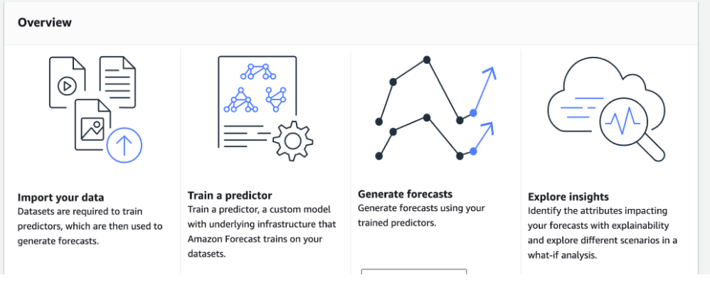

# AWS Forecast

- A fully managed service that uses machine learning to generate precise time-series predications or, as the name implies, forecasts
- Given a data set containing the time series data, we can observe what happens to the predication variables over time and once we recognize the pattern, we can then use that to infer future values

## References

https://aws.amazon.com/forecast/

https://tutorialsdojo.com/personal-ml-projects-with-amazon-sagemaker-amazon-comprehend-amazon-forecast-and-other-ml-services/

