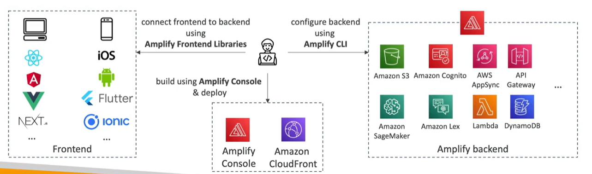

# AWS Amplify - web and mobile applications

- A set of tools and services to build full stack serverless web and mobile apps
- Authentication, storage, API (REST, GraphQL), CI/CD, analytics, PubSub, Analytics, AI/ML, Predictions, Monitoring,....
- Connect your source code from GitHub, AWS CodeCommit, Bitbucket, GitLab, etc.

