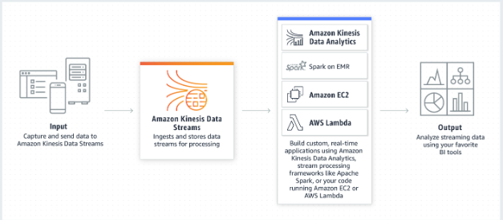
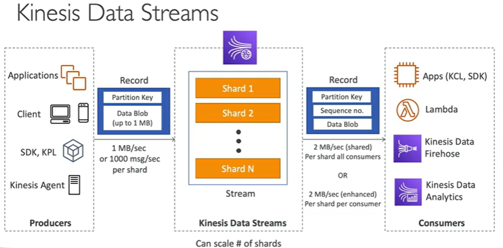
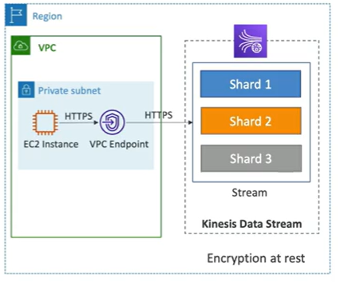

# AWS Kinesis Data Streams

Producers
- Send records to a stream through Applications, Clients, SDK, Kinesis Agent, or Kinesis Producer Library (KPL)
- Sends records which are composed of a partition key and a data blob. 
    - Partition key helps determine the shard
    - The data blob is an immutable sequence of bytes. Max size is 1 MB
    - Can send 1 MB/sec or 1000 messages/sec per shard

Shards
- Scale the number of shards

Consumers
-  Receives records which are composed of a partition key, a sequence number, and a data blob. 
- Can send 2 MB/sec per shard for all consumers (shared mode)
- Can send 2 MB/sec per shard for each consumer (enhanced/dedicated mode)
- Can be written to Apps, Lambda,  Kinesis Data Firehose, Kinesis Data Analytics

## Kinesis Data Streams

- Retention between 1 day to 365 days
- Ability to reprocess (replay) data
- Once data is inserted in Kinesis, it can't be deleted (immutability)
- Data that shares the same partition goes to the same shard (ordering)
- Producers: AWS SDK, Kinesis Producer Library (KPL), Kinesis Agent
- Consumers: 
    - Write you own: Kinesis Client Library (KCL), AWS SDK
    - Managed: AWS Lambda, Kinesis Data Firehose, Kinesis Data Analytics

## Kinesis Data Streams - Capacity Modes

- Provisioned Mode: 
    - Specify the number of shards you want to provision
    - In: Each shard gets 1 MB/sec or 1000 messages/sec
    - Out: Each shard gets 2 MB/sec (classic or enhanced fan-out)
    - You pay per shard provisioned per hour

- On-Demand Mode:
    - No need to provision or manage the capacity
    - Default capacity provisioned (4 MB/sec in or 4000 records per second)
    - Scales automatically based on observed throughput peak during the last 30 days
    - Pay per stream per hour & data in/our per GB

## Kinesis Data Streams Security

- Control access/authorization using IAM policies
- Encryption in flight using HTTPS endpoints
- Encryption at rest using KMS keys
- You can implement encryption/decryption in the client (harder)
- VPC Endpoints available to access within VPC
- Monitor API calls using CloudTrail

## References

https://aws.amazon.com/kinesis/data-streams/

https://docs.aws.amazon.com/lambda/latest/dg/with-kinesis.html

https://aws.amazon.com/premiumsupport/knowledge-center/503-error-classic/

