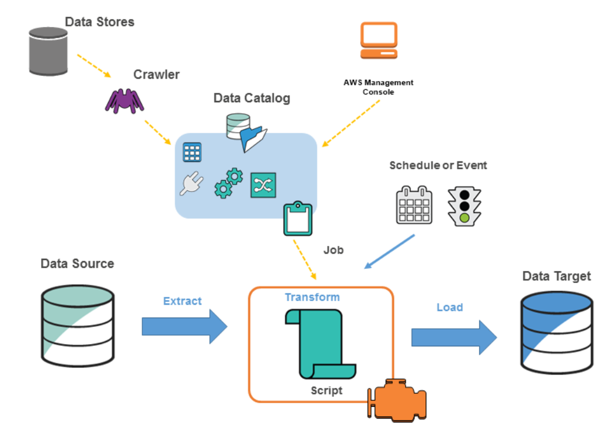

# AWS Glue

- A fully managed service to extract, transform, and load (ETL) your data for analytics.
- Discover and search across different AWS data sets without moving your data.
- AWS Glue consists of:
    - Central metadata repository
    - ETL engine
    - Flexible scheduler

## Use Cases

- Run queries against an Amazon S3 data lake
    - You can use AWS Glue to make your data available for analytics without moving your data.
- Analyze the log data in your data warehouse
    - Create ETL scripts to transform, flatten, and enrich the data from source to target.
- Create event-driven ETL pipelines
    - As soon as new data becomes available in Amazon S3, you can run an ETL job by invoking AWS Glue ETL jobs using an AWS Lambda function.
- A unified view of your data across multiple data stores
With AWS Glue Data Catalog, you can quickly search and discover all your datasets and maintain the relevant metadata in one central repository.

## References

https://tutorialsdojo.com/aws-glue/
