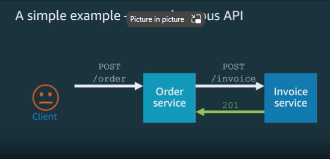
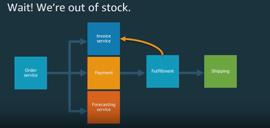
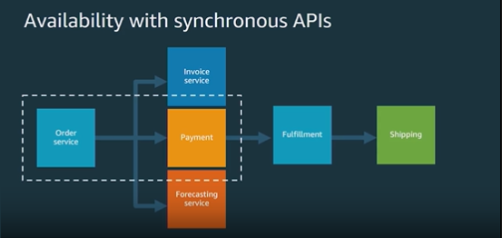
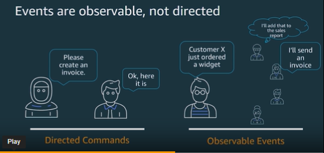
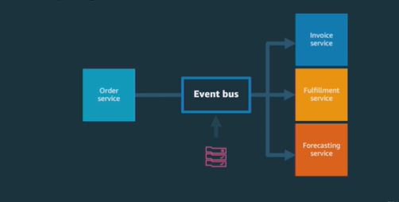
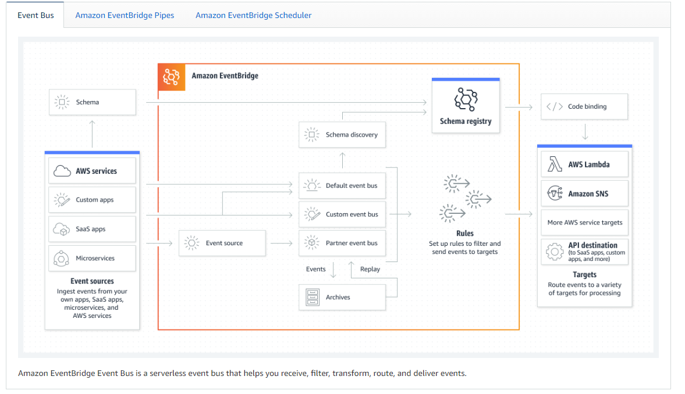
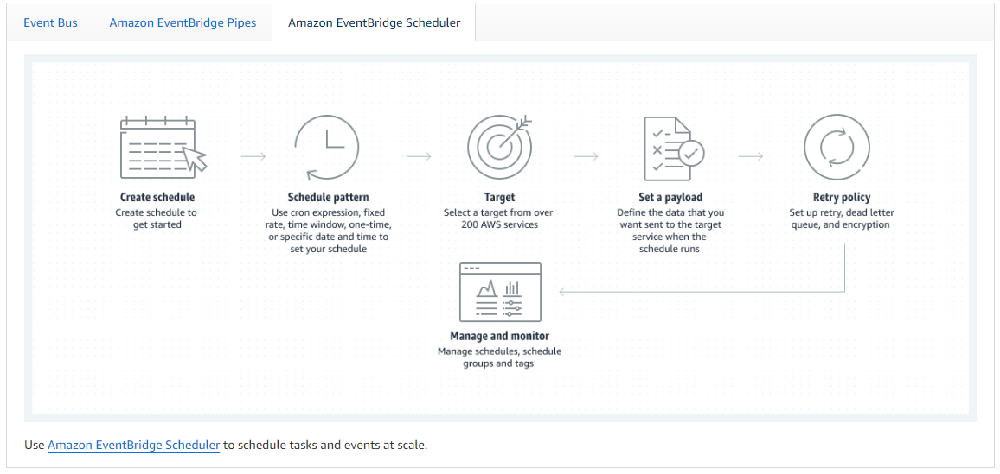

# AWS EventBridge

- EventBridge is a serverless event bus that makes it easy to connect applications together using data from your own applications, integrated Software-as-a-Service (SaaS) applications, and AWS services.

##  Problems with API calls
- Tight coupling between applications
    API calling another API.  For simple services, this is fine.  But when you add new services or change existing services, you have to update the API calls.  This is tight coupling.
- Choreographing events between applications is difficult
    
    What is the fulfillment service is out of stock? It notifies the Invoice Service to stop the Invoice, the Invoice service notifies the Shipping service to stop the shipment.  This is a lot of work to choreograph.
- Availability with synchronous API calls
    
      It takes longer to process payments than to take orders. So you put a slow service in front of a fast service.  In busy periods, the Payment service will hold up the Order service and customers will experience delays.  Outages: If the Payment service is down, the Order service is down
      Your availability metrics look bad due to an outage in single service

## Solution Eventbridge

- EventBridge Events are observable, not directed
    

- EventBridge uses an Event Bus for coordination

 The Event bus acts as a router sending events to the appropriate service.  The services are decoupled.  
    - The Order service does not know about the Invoice service.  
    - The Invoice service does not know about the Shipping service.  
    - If the Invoice service has a failure it will raise and error event on the Event bus and the event bus will route appropriately

- EventBridge Events are asynchronous

- EventBridge is serverless

- Key Benefits
    - Decoupled
    - Simplify event routing
    - Improved availability
    - Third party integration

## Event Bus

- An event bus is a channel for sending and receiving events. EventBridge has a default event bus that receives events from AWS services. You can also create custom event buses that receive events from your custom applications and services.

## EventBridge Pipes

## EventBridge Scheduler

## EventBridge Schema Registry

- The EventBridge Schema Registry is a feature that allows you to create a shared repository of schemas that can be used with EventBridge.

## References

- Good overview of EventBridge by James Beswick
    - https://pages.awscloud.com/AWS-Learning-Path-How-to-Use-Amazon-EventBridge-to-Build-Decoupled-Event-Driven-Architectures_2020_LP_0001-SRV.html?pg=ln&cp=bn
    - https://www.jbeswick.com/blog/2019/12/17/eventbridge

https://docs.aws.amazon.com/eventbridge/latest/userguide/eb-what-is.html

