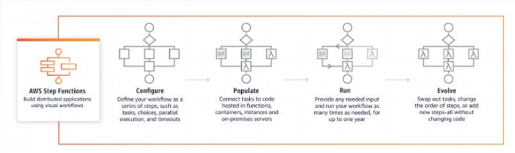

# AWS Step Functions

- A web service that provides serverless orchestration for modern applications.  
- It enables you to coordinate the components of distributed application and microservice using visual workflows

## Concepts
- Based on the concept of task and state machines
    - A task performs work by using an activity or an AWS Lambda function
    - A finite state machine can express an algorithm as an number of states, their relationship, and their input and output
- You define state machines using JSON-based Amazon States Language

## Standard vs Express Workflow

- Standard Workflow
    - Designed for long-running business processes that require durable state storage
    - Can execute for a maximum of one year

- Express Workflow
    - Designed for high-volume, short-duration workflows that can be completed within minutes or seconds
    - It can execute for a maximum of five minutes
    - Provides no durable state storage

    ## How Step Functions Work

    

    ## References

    https://tutorialsdojo.com/aws-step-functions/
    