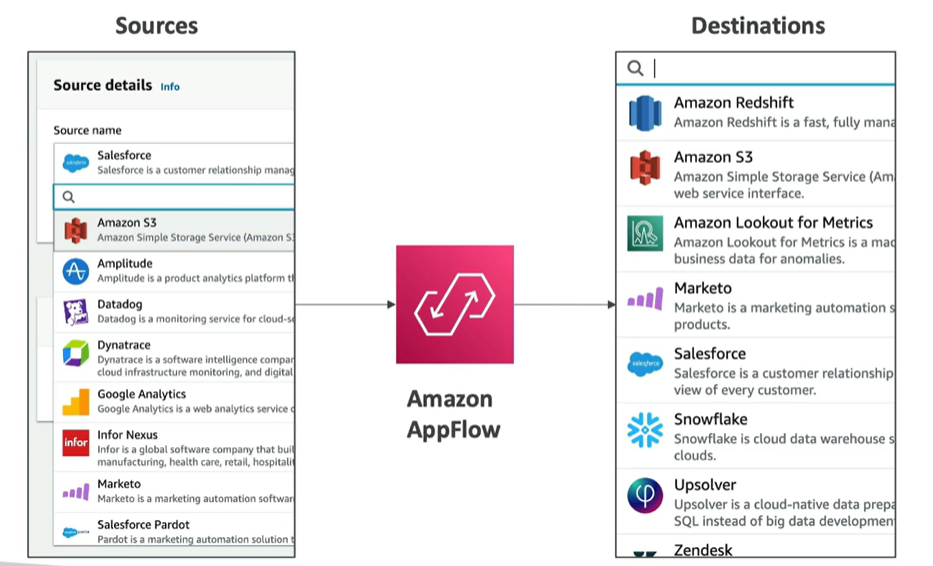

# Amazon AppFlow

- Fully managed integration service that enables you to securely transfer data between SaaS application and AWS services
- Sources: Salesforce, Zendesk, Slack, Google Analytics, Marketo, ServiceNow, Amazon S3, Amazon Redshift, Amazon EventBridge, Amazon Kinesis, Amazon SQS, Amazon SNS, Amazon AppFlow
- Destinations: Amazon S3, Amazon Redshift, ..., or non AWS services such as SnowFlake and Salesforce

## Concepts

- Frequency: on a schedule, in response to events, or on demand
- Data transformation: filter, map, and transform data
- Encrypted over the public internet or privately over AWS PrivateLink
- Don't spend time writing custom integrations or managing infrastructure

## References

https://tutorialsdojo.com/amazon-appflow/

https://aws.amazon.com/appflow/
