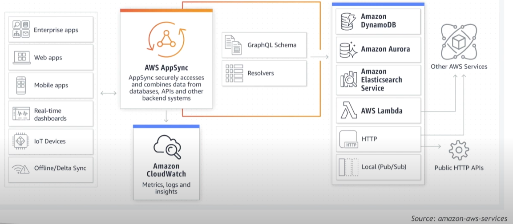
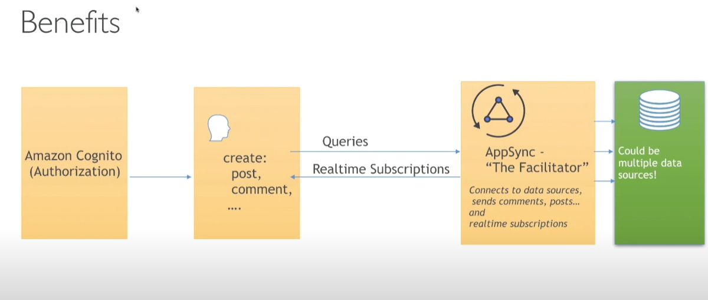
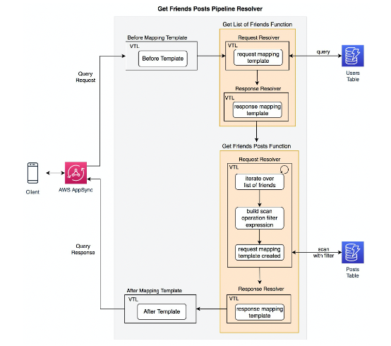

# AWS AppSync

- A serverless GraphQL and Pub/Sub API service that streamlines the development of modern web and mobile applications.
    - AppSync GraphQL APIs - provides a unified endpoint for securely querying and updating data from multiple databases, microservices, and APIs
    - AppSync Pub/Sub APIs - data updates are automatically published to subscribed API clients via serverless websockets

## Concepts

- GraphQL
    - It allows apps to retrieve data from servers
    - The GraphQL proxy is a component that runs the GraphQL engine to process requests and map them to logical functions for data operations and triggers
    - Three level operations:
        - Query - read data
        - Mutation - write data
        - Subscription - receive data updates in real time
    - The operations are exposed via a schema that defines the capabilities of the API
    - A schema is made up of types, which can be root or user-defined
    - To build a GraphLQ API, you need to define
        - GraphQL schema - each GraphQL API is defined by a single GraphQL schema
        - Data source - AWS resources that GraphQL can interact with
        - Resolvers - uses mapping templates to convert GraphQL requests into requests that the data source can understand
            - Unit resolver - maps a single field in the GraphQL schema to a single field in the data source
            - Pipeline resolver - maps a single field in the GraphQL schema to a sequence of functions in the data source. Alls easy retrieval of data from multiple data sources in a single call. 

## Use Case 1

Blog that connect to multiple back-end data sources

## Use Case 2 (Practice Exampl 5: Question 1)

A healthcare company manages patient data using a distributed system. The organization utilizes a microservice-based serverless application to handle various aspects of patient care. Data has to be retrieved and written from multiple Amazon DynamoDB tables.

The primary goal is to enable efficient retrieval and writing of data without impacting the baseline performance of the application as well as ensuring seamless access to patient information for healthcare professionals.

Answer: Utilize AWS AppSync pipeline resolvers to retrieve and write data from multiple DynamoDB tables in a single GraphQL request.

## Reference

https://www.youtube.com/watch?v=O-nr3983-ZY

https://tutorialsdojo.com/aws-appsync/

https://aws.amazon.com/appsync/

https://docs.aws.amazon.com/appsync/latest/devguide/what-is-appsync.html

https://docs.aws.amazon.com/appsync/latest/devguide/resolver-mapping-template-reference-dynamodb.html

https://aws.amazon.com/blogs/mobile/appsync-pipeline-resolvers-2/

https://aws.amazon.com/blogs/mobile/aws-appsync-pipeline-resolvers-and-functions-now-support-additional-array-methods-and-arrow-functions/

