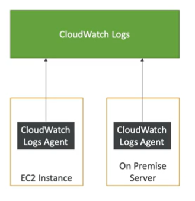

# CloudWatch Logs for EC2

- By default, no logs are sent to CloudWatch Logs
- You need to run a CloudWatch agent on your EC2 instance to send logs to CloudWatch Logs
- Make sure IAM permissions are correct
- CloudWatch Logs agent can be installed on-premises, on EC2 instances, or on-premises servers

