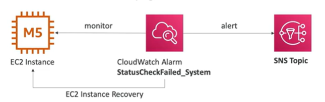

# EC2 Instance Recovery

- Status Check:
    - Instance status: checks the EC2 VM
    - System status: checks the underlying hardware

    

- Recovery actions:
    - Reboot
    - Stop/Start
    - Terminate
    - Recover
    - Rebuild

    - When a recovery happens you get the same Private, public IP, and Elastic IP, metadata, and placement group