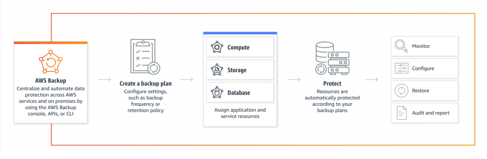

# AWS Backup

A Service that enables you to centralize and automate the backup of data across AWS services in the cloud and on premises.

## Concepts

- Backup plan
    - A policy expression that determines when and how you want your AWS resources backed up
    - Stores periodic backups incrementally
    - Backup plan can be created in AWS Backup console, API, CLI, SDK and AWS CloudFormation
- Backup vault
    - A container to store and organize backups
    - To encrypt the backups placed in a vault, you will need to use an AWS KMS
    - AWS Backup Vault Lock allows you to enforce a retention policy for your backups and prevent early deletions
- Backup 
    - The backup or recovery point is the content of a resource at a specific time

- AWS Backup Audit Manager
    - Audit frameworks
        - Provides a set of pre-built frameworks that you can use to assess the compliance of your backups
- Audit Report
    - Automatically generate an audit trail of daily or on-demand reports

## References

https://tutorialsdojo.com/aws-backup/
