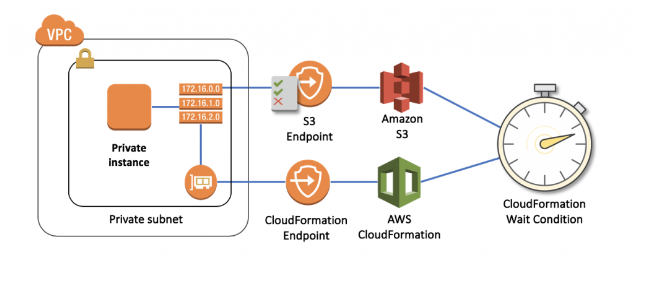

# Ensure components are properly running before stack creation proceeds

Configure the CreationPolicy attribute to the instance in the CloudFormation template.  Send a success signal after the applications are installed and configured using the cfn-signal helper script.  The CreationPolicy attribute supports the following properties:

You can associate the CreationPolicy attribute with a resource to prevent its status from reaching create complete until AWS CloudFormation receives a specified number of success signals or the timeout period is exceeded. To signal a resource, you can use the cfn-signal helper script or SignalResource API. AWS CloudFormation publishes valid signals to the stack events so that you track the number of signals sent.

The creation policy is invoked only when AWS CloudFormation creates the associated resource. Currently, the only AWS CloudFormation resources that support creation policies are AWS::AutoScaling::AutoScalingGroup, AWS::EC2::Instance, and AWS::CloudFormation::WaitCondition.

References:

https://docs.aws.amazon.com/AWSCloudFormation/latest/UserGuide/aws-attribute-creationpolicy.html

https://docs.aws.amazon.com/AWSCloudFormation/latest/UserGuide/deploying.applications.html#deployment-walkthrough-cfn-signal

https://aws.amazon.com/blogs/devops/use-a-creationpolicy-to-wait-for-on-instance-configurations/
