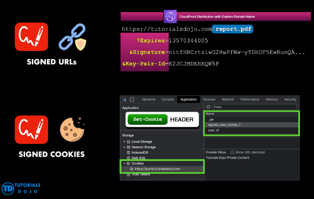

# CloudFront Restricting Access

- CloudFront can be used to restrict access to content so it can only be accessed by users who have permission to view it

To do this:

- Require the users access your content by using CloudFront URLs
- CloudFront signed URLs and signed cookies provide a way to control who can access your content

- Use signed URLs for the following use cases:
    - You want to use a RTMP distribution. Signed cookies aren't supported for RTMP distributions.
    - You want to restrict access to individual files, for example, an installation download for your application.
    - Your users are using a client (for example, a custom HTTP client) that doesn't support cookies.

- Use signed cookies for the following use cases:
    - You want to provide access to multiple restricted files, for example, all of the files for a video in HLS format or all of the files in the subscribers' area of a website.
    - You don't want to change your current URLs.