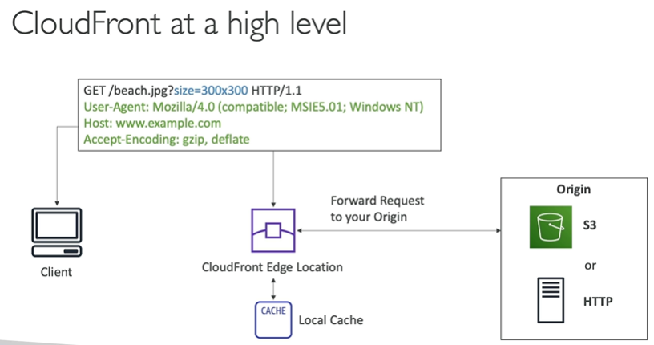

# AWS CloudFront

- Content Delivery Network (CDN)
- 216 Points of Presence globally (edge locations)
- DDos protection (because worldwide), integration with Shield, AWS Web Application Firewall (WAF)

## CloudFront Origins

- S3 bucket
    - For distributing files and caching them at the edge
    - Enhanced security with Origin Access Control (OAC)
    - OAC is replacing Origin Access Identity (OAI)
    - CloudFront can be used to upload files to S3 which is called ingress

- Custom Origin (HTTP)
    - Application Load Balancer
    - EC2 Instance
    - S3 Website (must enable static website hosting first)
    - Any HTTP backend you want

