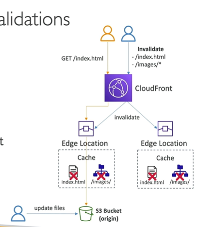

# Cache Invalidation

- In case you update the back-end origin, Cloudfront will not know about it and will keep serving the old content.
-You will only get the new content after the TTL expires.
- You can force an entire or partial cache refresh using cache invalidation.
- You can invalidate all files (*) or a special path (/images/*)

