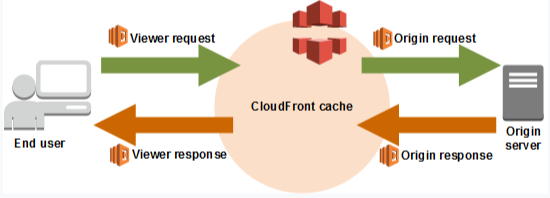

# AWS Lambda@Edge

- Lambda@Edge is an extension of AWS Lambda, a compute service that lets you execute functions that customize the content that CloudFront delivers
- You can use Lambda@Edge to change CloudFront requests and responses at the following points:
    - After CloudFront receives a request from a viewer (viewer request)
    - Before CloudFront forwards the request to the origin (origin request)
    - After CloudFront receives the response from the origin (origin response)
    - Before CloudFront forwards the response to the viewer (viewer response)

You can also setup an origin failover by creating an origin group with two origins, one as the primary origin, and the other as the second origin which CloudFront automatically switches to when the primary origin returns specific HTTP status codes such as 4xx or 5xx errors.

## References

https://docs.aws.amazon.com/AmazonCloudFront/latest/DeveloperGuide/high_availability_origin_failover.html

https://docs.aws.amazon.com/lambda/latest/dg/lambda-edge.html

https://tutorialsdojo.com/amazon-cloudfront/

https://tutorialsdojo.com/aws-lambda/