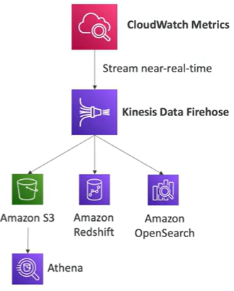
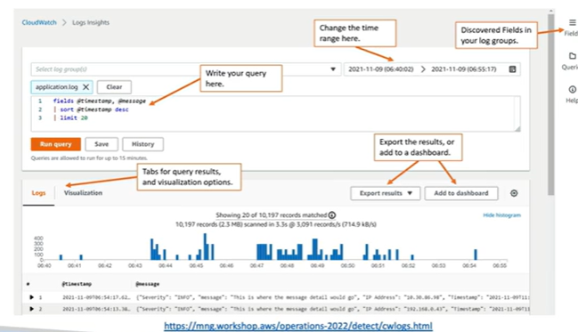
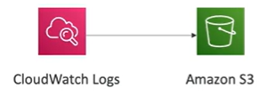
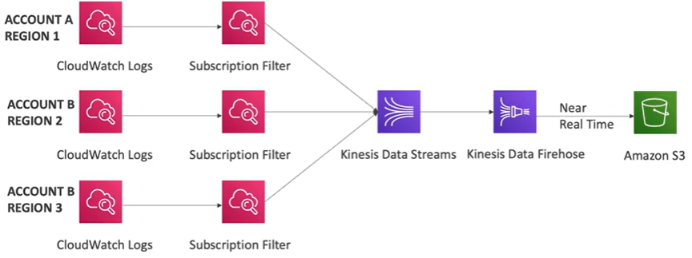
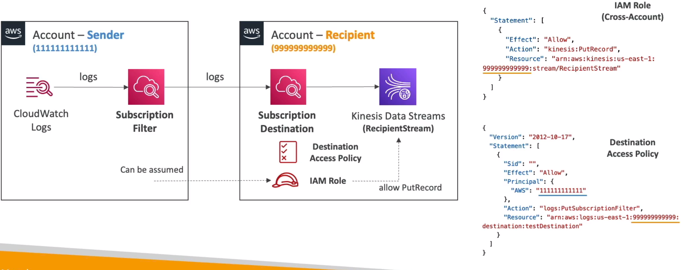

# Amazon CloudWatch 

## CloudWatch Metrics

- CloudWatch provides metrics for every services in AWS
- Metric is a variable to monitor (CPUUtilization, NetworkIn, etc.)
- Metrics belong to namespaces
- Dimension is an attribute of a metric (instance id, environment, etc.)
- Up to 30 dimensions per metric
- Metrics have timestamps
- Can create CloudWatch dashboards of metrics
- Can create CloudWatch custom metrics (for the RAM of a EC2 for example)

## CloudWatch Metrics Streams

- Continually stream CloudWatch metrics to a destination of your choice, with near-real-time delivery and low latency.  To

- Kinesis Data Firehose
- 3rd party partners: Datadog, New Relic, etc.

## CloudWatch Logs

- Log group: arbitrary name, usually representing an application
- Log stream: instances within application/log files/containers
- Can define log expiration policies (never expire, 30 days, etc.)
- CloudWatch Logs can send logs to:
    - Amazon S3 (exports)
    - Kinesis Data Firehose
    - Kinsesis Data Streams
    - Lambda function
    - OpenSearch Service / Elasticsearch
- Logs are encrypted using KMS at the group level
- Can setup KMS-based encryption with you own keys

## CloudWatch Logs Sources

- SDK, CloudWatch Logs Agent, CloudWatch Unified Agent
- Elastic BeanStalk: collection of logs from application
- ECS: collection from containers
- Lambda: collection from function logs
- VPC Flow Logs: VPC specific logs
- API Gateway
- CloudTrail based on filter
- Route53: Log DNS queries

To query CloudWatch logs, you can use CloudWatch Insights

Allows you to: 
- Search and analyze log data stored in CloudWatch Logs
- Example: find a specific IP inside a log, count occurances of "ERROR" in logs, etc.
- Provides a purpose-built query language
- Can query multiple log groups in different AWS accounts
- it is a query engine, not a real-time engine 

## CloudWatch Logs - S3 Export

- You can export CloudWatch logs to S3 for archival
- Log data can take up to 12 hours to become available for export
- The API call is CreateExportTask
- Not near-real time or real-time...use Logs Subscription instead

## CloudWatch Logs Subscriptions

- Real-time streaming of log data from CloudWatch Logs to:
    - Amazon Kinesis Data Streams
    - Amazon Kinesis Data Firehose
    - AWS Lambda
- Subscription Filter - filter which logs are events delivered to your destination

## Cloud Watch Logs Aggregation Multi-Account & Multi-Region

- You can have CloudWatch logs from multiple accounts and multiple regions sent to a central CloudWatch account

- Cross-account subscriptions - send logs from multiple accounts to a central account

To do this you need to send to the subscription filter in the sender account,  which forwards to a subscription destination which is a virtual to kinesis data streams in the central account

Permissions:
- Destination Access Policy to allow the Sender account to write to the Destination account Filter
- IAM role which allows to put data into the Kinesis Data Stream. This role must be allows to be assumed in the Sender account

## References

https://tutorialsdojo.com/amazon-cloudwatch/

