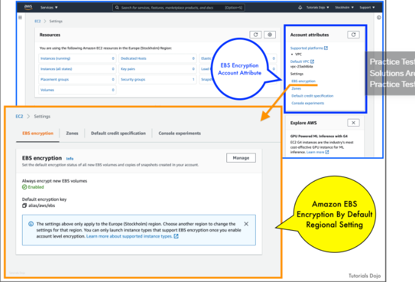

# AWS EBS Encryption by Default

You can configure your AWS account to enforce the encryption of the new EBS volumes and snapshot copies that you create. For example, Amazon EBS encrypts the EBS volumes created when you launch an instance and the snapshots that you copy from an unencrypted snapshot.

- Encryption by default is a Region-specific setting. If you enable it for a Region, you cannot disable it for individual volumes or snapshots in that Region.

- When you enable encryption by default, you can launch an instance only if the instance type supports EBS encryption.

- Amazon EBS does not support asymmetric CMKs.

You cannot change the CMK that is associated with an existing snapshot or encrypted volume. However, you can associate a different CMK during a snapshot copy operation so that the resulting copied snapshot is encrypted by the new CMK

## References

https://tutorialsdojo.com/amazon-ebs/

https://docs.aws.amazon.com/AWSEC2/latest/UserGuide/EBSEncryption.html#encryption-by-default

https://docs.aws.amazon.com/kms/latest/developerguide/services-ebs.html

