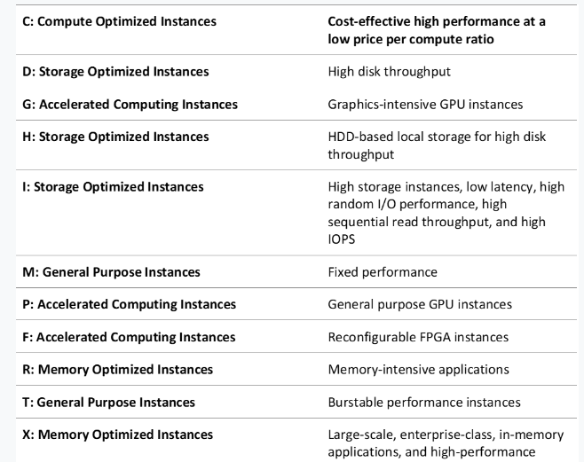

# EC2 Instance Types

- Compute Optimized Instances
- Storage Optimized Instances
- Accelerated Computing Instances
- Memory Optimized Instances

## References

https://tutorialsdojo.com/amazon-elastic-compute-cloud-amazon-ec2/
