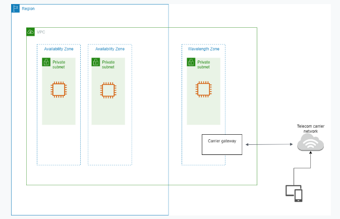

# AWS Wavelength

- A service that allows developers to create applications with ultra-low latency for mobile devices and users by deploying them to the edge of the 5G network
- Wavelength Zones are AWS infrastructure deployments that embed AWS compute and storage services within the telecommunications providers' data centers at the edge of the 5G network
- Wavelength Zones also allow developers to build the next generation ultra-low latency applications using the same familiar AWS services, APIs, management tools, and functionality they use today
- Wavelength Zones can be used to extend an Amazon VPC to the edge of the 5G network and deploy AWS resources closer to end-users to reduce latency

## Features

- Wavelength Zones support a wide range of compute instances for general purpose, gaming and machine learning inference workloads

## Use Cases

- Create and distribute augemented/virtual reality (AR/VR) apps, as well as HD live video streaming
- Use AI and ML-powered video and image analytics at the edge to accelerate 5G applications in medical diagnosis, industrial automation, and smart cities

# Use Case Practice Exam 5: Question 2

A company needs to accelerate the performance of its AI-powered medical diagnostic application by running its machine learning workloads on the edge of telecommunication carriers' 5G networks. The application must be deployed to a Kubernetes cluster and have role-based access control (RBAC) access to IAM users and roles for cluster authentication.

Which of the following should the Solutions Architect implement to ensure single-digit millisecond latency for the application?

Answer: Launch the application to an Amazon Elastic Kubernetes Service (EKS) cluster. Create node groups in WaveLength Zones for the Amazon EKS cluster via the AWS WaveLength service. Apply the AWS authenticator configuration map (aws-auth ConfigMap) to your cluster.

## References

https://tutorialsdojo.com/aws-wavelength/

https://aws.amazon.com/wavelength/

https://docs.aws.amazon.com/wavelength/latest/developerguide/what-is-wavelength.html
