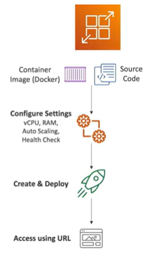

# AWS App Runner

- Fully managed service that makes it easy to deploy web applications and API's at scale
- No infrastructure to manage
- Start with your source code or a container image
- Automatically builds and deploys your application
- Automatic scaling, highly available, load balancer, encryption
- VPC access support
- Connect to database, cache, and message queue services

- Use cases: web apps, API's, microservices, rapid production deployments

