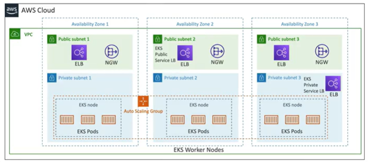

# Amazon EKS

- Amazon EKS - Amazon Elastic Kubernetes Service
- It is a way to launch managed Kubernetes clusters on AWS
- Kubernetes is an open-source system for automating the deployment, scaling, and management of containerized applications
- Its an alternative to ECS, similar goal but different API
- EKS supports EC2 if you want to deploy worker nodes or Fargate to deploy serverless containers
- Use cases: if your company is already using Kubernetes on-premise or in another cloud, and wants to migrate to AWS using Kubernetes
- Kubernetes is cloud-agnostic, so you can use it on-premise or in any cloud

- EKS nodes are EC2 instances
- EKS nodes run EKS pods
- Nodes can be managed by an autoscaling group
- Could setup a private local balancer to talk to the EKS cluster

## EKS - Node Types

- Managed Node Groups
    - Creates and managed Nodes (EC2 instances) for you
    - Nodes are part of an Auto Scaling Group managed by EKS
    - Supports On-Demand or Spot Instances

- Self-Managed Nodes
    - Nodes created by you and registered with EKS cluster and managed by an ASG
    - You can use prebuilt AMIs - Amazon EKS Optimized AMI    

- AWS Fargate
    - No maintenance required

## EKS - Data Volumes

- Need to specify StorageClass manifest on your EKS cluster
- EKS supports 
    - EBS
    - EFS (works with Fargate)
    - FSx for Lustre
    - FSx for Windows File Server
    - FSx for ONTAP

## EKS - Secret Manager Integration

- EKS can integrate with AWS Secrets Manager to store sensitive data
- To do this you need to create a new KMS Key and use it to encrypt the secrets
- Then you need to create a secret in Secrets Manager

References
https://docs.aws.amazon.com/secretsmanager/latest/userguide/integrating_csi_driver.html

https://docs.aws.amazon.com/eks/latest/userguide/what-is-eks.html

https://docs.aws.amazon.com/eks/latest/userguide/security.html

Cheatsheet

https://tutorialsdojo.com/amazon-elastic-kubernetes-service-eks/

https://tutorialsdojo.com/aws-secrets-manager/
