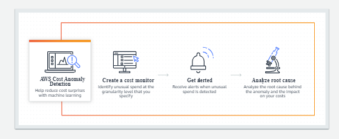

# Cost Anomoly Detection

- Summary provides and outline of any cost anomalies detected, and summarizes the impact to your overall spend

- Monitoring types include:

    - AWS Services
    - Linked Accounts
    - Cost Category
    - Cost Allocation Tag