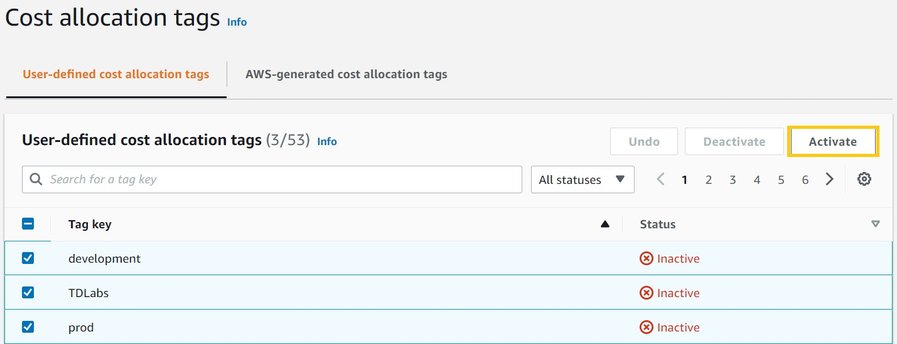

# AWS Cost Allocation Tags

- Tags are labels you can apply to your AWS resources
- Apply tags to AWS resources to categorize them by purpose, owner, or other criteria
- Then active the tags in the Billing and Cost Management console, and you can track the costs associated with those resources

Use Case would be to put a tag on a S3 bucket and then track the costs associated with that bucket in Cost Explorer 

## References
https://tutorialsdojo.com/cost-allocation-tags-on-amazon-s3-buckets-and-using-aws-cost-explorer/

https://docs.aws.amazon.com/awsaccountbilling/latest/aboutv2/cost-alloc-tags.html

https://aws.amazon.com/blogs/aws-cloud-financial-management/cost-allocation-blog-series-2-aws-generated-vs-user-defined-cost-allocation-tag/