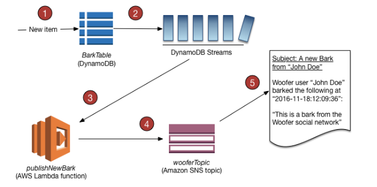

# DynamoDB Streams

- Ordered flow of information about changes to items in a DynamoDB table
- Captures every modification to data items in the table
- Integrated with AWS Lambda and Kinesis Data Streams
- You have to enable DynamoDB Streams on a table

## References

https://docs.aws.amazon.com/amazondynamodb/latest/developerguide/Streams.html

https://docs.aws.amazon.com/amazondynamodb/latest/developerguide/Streams.Lambda.Tutorial.html

https://tutorialsdojo.com/amazon-dynamodb/