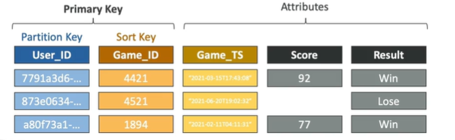
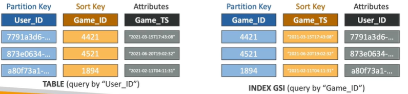

# DynamoDB - Local Secondary Indexes (LSI) and Global Secondary Indexes (GSI)

Local Secondary Indexes (LSI) and Global Secondary Indexes (GSI) are indexes that you can create on your DynamoDB tables to improve your query performance.

## Local Secondary Index (LSI)
- Alternative Sort Key for your table (same Partition Key as that of the base table)
- The Sort Key consists of exactly one scalar attribute (String, Number or Binary)
- Up to 5 LSIs per table
- Attribute Projections - can contain some or all the attributes from the base table (KEYS_ONLY, INCLUDE, ALL)

If you want to do a query on User_ID and Game_TS, you can create a LSI on Game_TS and use that as the Sort Key.

If you do that you can do a query on User_ID and Game_TS, but you cannot do a query on Game_TS alone.

## Global Secondary Index (GSI)
- Alternative Primary Key (HASH + RANGE) for your table
- Speed up queries on non-key attributes
- The Index Keys consists of scalar attributes (String, Number or Binary)
- Attribute Projections - some or all attributes from the base table (KEYS_ONLY, INCLUDE, ALL)
- Must provision RCUs and WCUs for the index
- Can be added/modified after table creation

If you create a GSI called Index you can now query by Game_ID and Game_TS, but you cannot query by User_ID and Game_TS.

## Indexs and Throttling

- GSI's have their own read and write capacity units.  These are set independently of the base table.
- Global Secondary Index (GSI)
    - If the writes are throttled on the GSI, the base table will be throttled but this throttling is specific to the GSI and does not affect the base table performance
    - Even if the WCU on the main tables are fine
    - Choose the GSI partition key wisely

