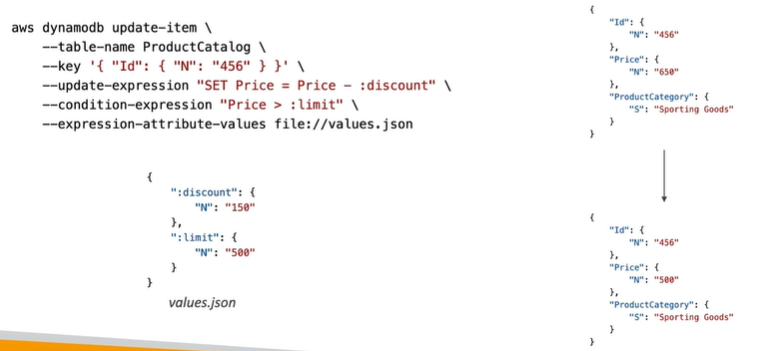

# DynamoDB Operations

Writing Data

- PutItem: creates a new item, or replaces an old item with a new item
- UpdateItem: edits an existing item's attributes, or adds a new item to the table if it does not already exist
- Conditional Writes: PutItem and UpdateItem operations can be constrained to only succeed if the item's attribute values match certain conditions

Conditional Writes
- PutItem, UpdateItem, DeleteItem, and BatchWriteItem operations can be constrained to only succeed if the item's attribute values match certain conditions
- You specify the conditions using ConditionExpression
    - attribute_exists (attribute)
    - attribute_not_exists (attribute)
    - attribute_type (attribute, type)
    - contains (attribute, operand)
    - begins_with (attribute, operand)
    - ProductCategory IN ( :val1, :val2, ... )

- Note: Filter Expression filters the results of a read queries, while ConditionExpression are for write operations

Reading Data

- GetItem: 
    - retrieves a single item from a table
    - Primary key can be HASH or HASH+RANGE
    - ProjectionExpression: allows you to specify the attributes you want in the result

Reading Data - Query

- Query returns items based on:
    - KeyConditionExpression: 
        - Partition Key value (must be = operator) - required
        - Sort Key value (=,<,<=,>=, Between, Begins_with) - optional
    - FilterExpression:
        - Additional filtering after Query has been processed (before data returned to you)
        - Use only with non-key attributes
- Returns
    - The number of items specified in Limit
    - Or up to 1 MB of data
- Ability to do pagination
- Can query table, a Local Secondary Index, or a Global Secondary Index

Reading Data - Scan
- Scan the entire table and then filter out data (inefficient)
- Returns up to 1 MB of data, use pagination to retrieve more
- Consumes more RCU than Query
- Limit impact using Limit or reduce the size of the result and pause
- For faster performance, use parallel scans
- Can use ProjectionExpression and FilterExpression (no changes to RCU) 
- Supports pagination using -max-items and -starting-token as part of the scan command

