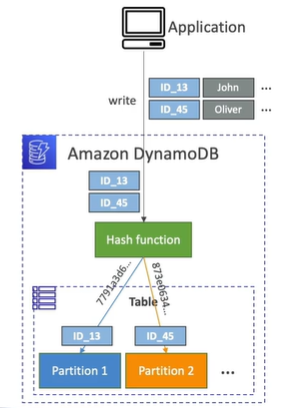

# DynamoDB - Partitions Internals

- Data is stored in partitions
- Partition Keys go through a hashing algorithm to know which partition they go to

- To compute the number of partitions:
    - # of partitions (by capacity) = (RCU / 3000) + (WCU / 1000)
    - # of partitions (by size) = (Total size of items in table and indexes) / 10 GB
    - # of partitions = ceil(max(# of partitions by capacity, # of partitions by size))

- WCUs and RCUs are distributed evenly across partitions

