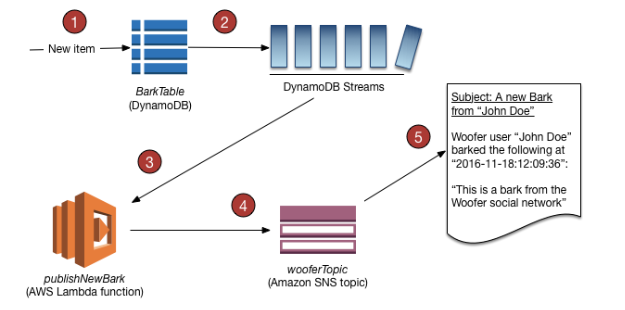

# DynamoDB Streams

- Ordered flow of information about changes to items in a DynamoDB table
- Captures every modification to data items in the table
- Stream records can be:
    - Sent to Kinesis Data Streams
    - Read by AWS Lambda
    - Read by Kinesis Client Library applications
- Data Retention for up to 24 hours
- Ability to choose that will be written to the stream
    - KEYS_ONLY - only the key attributes of the modified item
    - NEW_IMAGE - the entire item, as it appears after it was modified
    - OLD_IMAGE - the entire item, as it appeared before it was modified
    - NEW_AND_OLD_IMAGES - both the new and the old images of the item

- Use cases
    - react to changes in real-world
    - Analytics

## References

https://docs.aws.amazon.com/amazondynamodb/latest/developerguide/Streams.html

https://docs.aws.amazon.com/amazondynamodb/latest/developerguide/Streams.Lambda.Tutorial.html

https://tutorialsdojo.com/amazon-dynamodb/