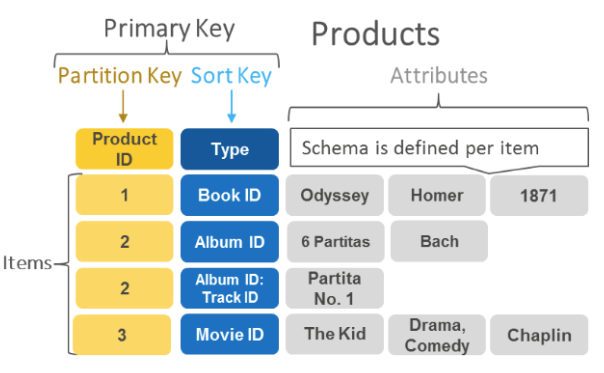

# Amazon DynamoDB

- AWS proprietary technology, managed serverless NoSQL database, millisecond latency
- Capacity modes: 
    - Provisioned capacity with optional auto-scaling or on-demand capacity
    - Can replace ElasticCache as a key/value store (storing session data for example, using TTL feature)
- Highly Available, Multi-AZ by default, Read and Writes are decoupled, transaction capability
- DAX cluster for read cache, microsecond read latency
- Security, authentication and authorization is done through IAM
- Event Processing: DynamoDB Streams to integrate with AWS Lambda, or Kinesis Data Streams
- Global Table feature: active-active setup
- Automated backups up to 35 days with a PITR (restore to new table), or on-demand backups
- Export to S3 without using RCU within the PITR window, import from S3 without using WCU
- Great for rapidly evolving schemas

- Use Case: Serverless applications development (small documents 100s KB), distributed serverless cache

## Core Components

- Tables: a collection of items
- Items: a collection of attributes
    - DynamoDB uses primary keys to uniquely identify each item in a table and secondary indexes to provide more querying flexibility.
- Attribute: a fundamental data element
- Primary Key: uniquely identifies each item in a table, must be unique, can be partition key or partition key + sort key
    - Partition Key: simple primary key, unique for each item, used to distribute data across partitions
    - Partition Key + Sort Key: composite primary key, composed of two attributes, first is partition key, second is sort key, used to organize data within a partition
- Secondary Index: lets you query the data in the table using an alternate key, in addition to queries against the primary key

## Partition Keys and Performance

- Partition keys portion of the tables's primary key determines the logical partitions in which a tables's data is stored
- This affects the underlying physical partitions
- Therefore a partition key design is important for performance
- In general, a good partition key has a large number of distinct values, with a random distribution across partitions

References
https://tutorialsdojo.com/amazon-dynamodb/

https://www.youtube.com/watch?v=3ZOyUNIeorU

Partition Keys and Data Distribution:
https://docs.aws.amazon.com/amazondynamodb/latest/developerguide/bp-partition-key-uniform-load.html

https://aws.amazon.com/blogs/database/choosing-the-right-dynamodb-partition-key/

