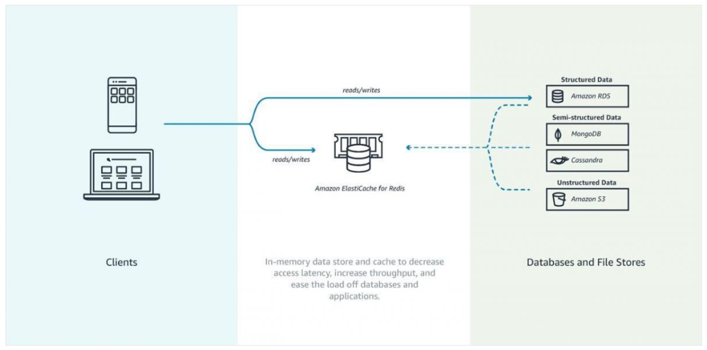

# AWS ElastiCache

- ElastiCache is a distributed in-memory cache environment in the AWS Cloud.
- ElastiCache works with both the Redis and Memcached engines.

## Components

## Reference

https://tutorialsdojo.com/amazon-elasticache/

