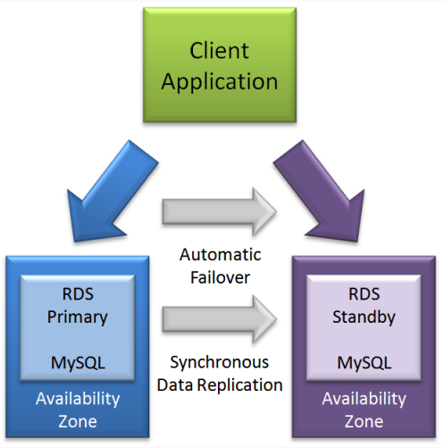

# RDS High availability using Multi-AZ

- You can run your DB instance in several AZs, and option called a Multi-AZ deployment.
- Amazon automatically provisions and maintains a secondary standby DB instance in a different AZ.  Your primary DB instance is synchronously replicated across Azs to the secondary instance to provide data redundancy, eliminate I/O freezes, and minimize latency spikes during system backups.  In the event of planned database maintenance, DB instance failure, or an AZ failure, Amazon RDS automatically fails over to the standby so that database operations can resume quickly without administrative intervention.  Multi-AZ deployments for Oracle, PostgreSQL, MySQL, MariaDB, and SQL Server DB instances use Amazon technology, while Amazon Aurora DB instances use Aurora replication.  Multi-AZ deployments are not supported for SQL Server DB instances using SQL Server Mirroring, or for Oracle DB instances using Oracle Data Guard.

## Reference

https://aws.amazon.com/rds/features/multi-az/

https://docs.aws.amazon.com/AmazonRDS/latest/UserGuide/Concepts.MultiAZ.html

https://tutorialsdojo.com/amazon-relational-database-service-amazon-rds/
