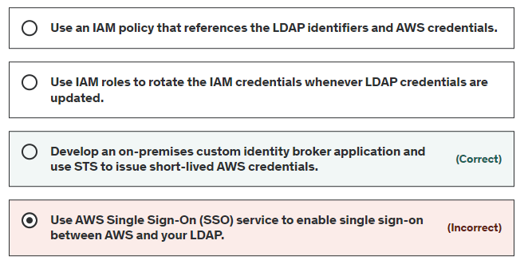
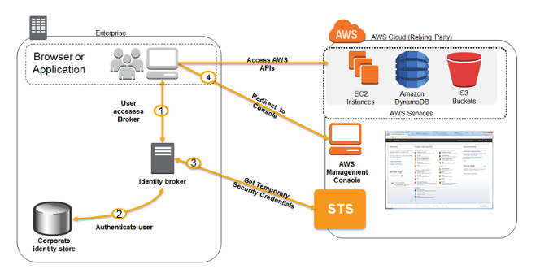

# Practice Exam 4 question 7

Custom Identity Broker:

A company needs to integrate their LDAP directory service from on-premise data center to AWS VPC using IAM. The identity store is not compatible with SAML.

- Build a broker application
- Broker authenticates users, request temp credentials for users from AWS, then provides access to AWS resources

## References

https://docs.aws.amazon.com/IAM/latest/UserGuide/id_roles_common-scenarios_federated-users.html

https://aws.amazon.com/blogs/aws/aws-identity-and-access-management-now-with-identity-federation/
