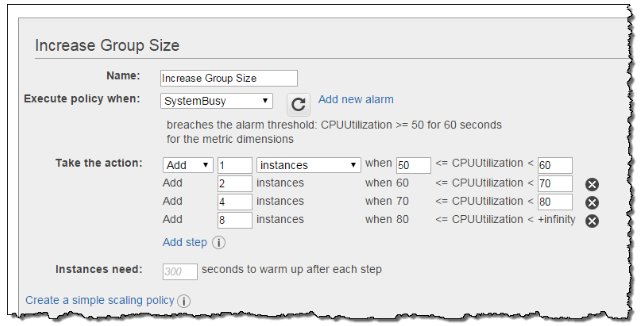

#  Auto Scaling Policy

Auto Scaling Policy is a set of instructions for scaling your Auto Scaling group. You can create a policy and attach it to your Auto Scaling group to define how the group should respond to alarm breaches.

There are two types of scaling policies:

## Simple Scaling
- Increase or decrease the current capacity of the group based on a single scaling adjustment.
- Only scaling that supports a cooldown period

## Target Tracking Scaling
- Increase or decrease the current capacity of the group based on a target value for a specific metric.
- If you are scaling based on a utilization metric that increases or decreases proportionally with the number of instances in the Auto Scaling group, target tracking scaling is an easy way to scale out your application based on demand, otherwise it is better to use step scaling.

## Step Scaling
- Increase or decrease the current capacity of the group based on a set of scaling adjustments, known as step adjustments, that vary based on the size of the alarm breach.

## Scheduled Scaling

- Increase of decrease based on the date and time. The timezone can either be in UTC or in your local timezone.

## Question 19: Test 5

An application is hosted in an Auto Scaling group of EC2 instances. To improve the monitoring process, you have to configure the current capacity to increase or decrease based on a set of scaling adjustments. This should be done by specifying the scaling metrics and threshold values for the CloudWatch alarms that trigger the scaling process.

Which of the following is the most suitable type of scaling policy that you should use?

Answer: Step Scaling.

Target tracking scaling is incorrect because the target tracking scaling policy increases or decreases the current capacity of the group based on a target value for a specific metric instead of a set of scaling adjustments.

## References
https://docs.aws.amazon.com/autoscaling/ec2/userguide/as-scale-based-on-demand.html

https://docs.aws.amazon.com/autoscaling/application/userguide/application-auto-scaling-step-scaling-policies.html