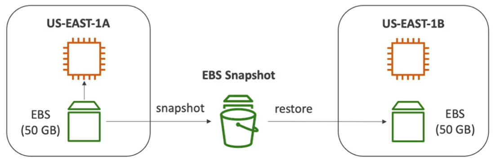

# EBS Storage

- An EBS (Elastic Block Store) volume is a network drive you can attach to your instances while they run
- It allows your instances to persist data, even after their termination
- They can only be mounted to one instance at a time (at the CCP level)
- They are bound to a specific AZ
- EBS volumes support live configuration changes while in production which means that you can modify the volume type, volume size, and IOPS capacity without service interruptions.
- Amazon EBS encryption uses 256-bit Advanced Encryption Standard algorithms (AES-256)
- EBS Volumes offer 99.999% SLA.

- Analogy: think of them as a "network USB stick"
- Free tier: 30GB of free EBS storage of type General Purpose (SSD) or Magnetic per month

- It is a network drive (i.e. not a physical drive)
- Its locked to an Availability Zone (AZ)
- Have a provisioned capacity (size in GBs, and IOPS)

## EBS Snapshots

- Make a backup (snapshot) of your EBS volume at a point in time
- Not necessary to detach volume to do snapshot, but recommended
- Can copy snapshots across AZ or Region (encrypted snapshots can only be copied to regions that support encryption)

EBS Snapshot Features

- EBS Snapshot Archive
    - Move Snapshot to an "archive tier" that is 75% cheaper
    - Takes within 24-72 hours for restoring the archive

- Recycle Bin for EBS Snapshots
    - Ability to recover an EBS snapshot that you have deleted
    - Must be enabled on a per-region basis
    - Retention period of 1 day to 1 year

- EBS Fast Snapshot Restore (FSR)
    - Force full initialization of EBS volumes from snapshots (instantaneous) - no latency for first use ($$$)

## References

https://tutorialsdojo.com/amazon-ebs/

https://youtu.be/ljYH5lHQdxo
