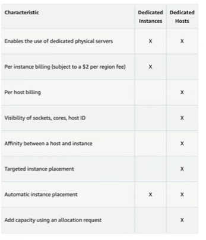
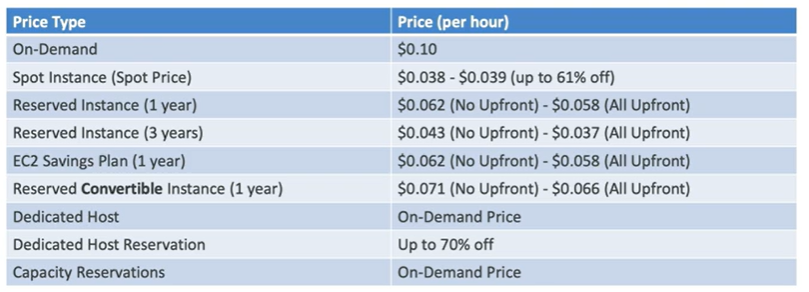

# EC2 Instance Purchasing Options

- On-Demand Instances - short workload, predictable pricing, pay by second
- Reserved (1 & 3 years) 
    - Reserved instances - long workloads
    - Convertible Reserved Instances - long workloads with flexible instances
- Savings Plans (1 & 3 years)- 
    - Commit to consistent usage (hourly), long workload
- Spot Instances - short workloads, cheap, can lose instances (less reliable)
- Dedicated Hosts
    - Book an entire physical server, control instance placement
    - regulatory requirements, licensing, can be shared between accounts
- Dedicated Instances
    - no other customer will share your hardware
- Capacity Reservations
    - reserve capacity for EC2 instances in a specific Availability Zone for any duration

## On-Demand Instances

## Reserved Instances

- Up to 72% discount compared to On-demand
- You reserve a specific instance attribute (Instance Type, Region, Tenancy, OS)
- Period - 1 year or 3 years
- Payment Options - No Upfront, Partial Upfront, All Upfront
- Reserved Instance's Scope - Regional or Zonal (reserve capacity in an AZ)
- You can buy and sell in the Reserved Instance Marketplace

- Convertible Reserved Instances
    - Can change the EC2 instance type, instance family, OS, scope, tenancy
    - Up to 66% discount

## Savings Plans

- Get discount based on long-term usage (up to 72% - same as RIs)
- Commit to a certain type of usage ($10/hour for 1 or 3 years)
- Usage beyond EC2 savings plans is billed at the On-Demand price
- Locked to a specific instance family & AWS region (e.g. M5 in us-east-1)
- Flexible across:
    - Instance size (m5.large, m5.xlarge, m5.2xlarge, etc.)
    - OS (Linux, Windows, etc.)
    - Tenancy (Shared - multiple AWS accounts share hardware, Dedicated-single tenant hardware)

## Spot Instances
- Can get a discount of up to 90% compared to On-Demand
- Instances that you can lose at any point of time
- The MOST cost-efficient instances in AWS

## Dedicated Hosts
- A **physical dedicated EC2 server** for your use
- Allows you to address compliance requirements
- Control of instance placement
- Purchase options
    - On-demand - pay per second for active Dedicated Host
    - Reserved - 1 year or 3 year reservation
- Most expensive option

## Dedicated Instances
- Instances running on hardware that's dedicated to you
- May share hardware with other instances in same account
- No control over instance placement (can move hardware after stop/start)

## Dedicated Hosts vs Dedicated Instances

## EC2 Capacity Reservations
- Reserve capacity for your EC2 instances in a specific Availability Zone for any duration
- You always have access to EC2 capacity when you need it
- Not time commitment (create/cancel anytime), no billing discounts
- Combine with Regional Reserved Instances and Savings Plans to benefit from billing discounts
- Your charged at On-Demand rate whether you run instances or not
- Suitable for short-term, uninterrupted workload that needs to be in a specific AZ

## Price Comparison

