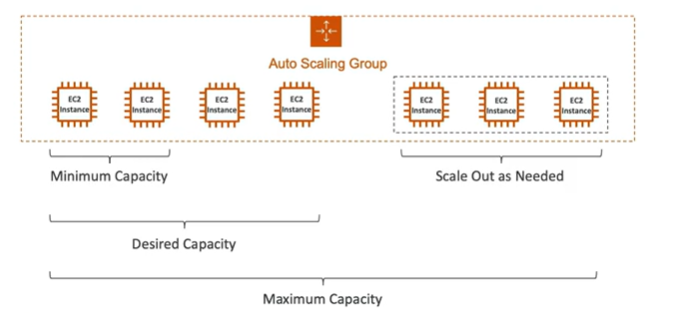

# What is an Auto Scaling Group?

- In real-life, the load on your websites and applications can change
- In the cloud, you can create and get rid of servers very quickly

- The goal of an Auto Scaling Group (ASG) is to:
    - Scale out (add EC2 instances) to match an increased load
    - Scale in (remove EC2 instances) to match a decreased load
    - Ensure we have a minimum and a maximum number of machines running
    - Automatically register new instances to a load balancer
    - Replace unhealthy instances
    - ASG makes use of Launch Configurations or Launch Templates. Launch templates contain
        - AMI + Instance Type
        - EC2 user data
        - EBS Volumes
        - Security Groups
        - SSH Key Pair
        - IAM Roles for your EC2 Instances
        - Network Settings

- ASG are free. You pay for the underlying resources being launched

## Auto Scaling in AWS

Auto Scaling Group (ASG) are behind a load balancer

## Auto Scaling Policies

There are two types of scaling policies:

Simple/Step Scaling Policies
    - Require a CloudWatch alarm
    - Specify the low and high thresholds for the alarm
    - Require you to specify high and low thresholds for the alarm
    - Step adjustments are based on the size of the alarm breach and can increase or decrease the current capacity of your Auto Scaling group
    - The policy must wait for the previous scaling activity to complete before any further scaling activities can start
Target Tracking Scaling Policies
- Use a target value for a specific metric
- Helps over-provisioning and under-provisioning of resources
- Adjust to changes in the metric due to a changing load pattern

    - 

## Auto Scaling Lifecycle

Default Termination Policy:

The default termination policy is to select the AZ which has the most instances and terminate the EC2 instance in that AZ.

1. If there are instances in multiple AZs, select the one with the most instances that is not protected from scale in. If there is more than one AZ with this number select the one with the oldest launch configuration.
2. If there are more than one with instances and same launch configuration determine the instance closest to the next billing hour and terminate it
3. If there is more than 1 closest to the next billing hour, choose one at random

## References

https://tutorialsdojo.com/aws-auto-scaling/

https://docs.aws.amazon.com/autoscaling/ec2/userguide/as-scaling-target-tracking.html

https://docs.aws.amazon.com/autoscaling/ec2/userguide/AutoScalingGroup.html

Scale in and out:

https://docs.aws.amazon.com/autoscaling/ec2/userguide/as-instance-termination.html#default-termination-policy

https://docs.aws.amazon.com/autoscaling/ec2/userguide/as-instance-termination.html
