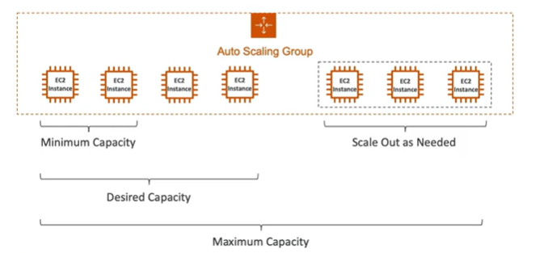
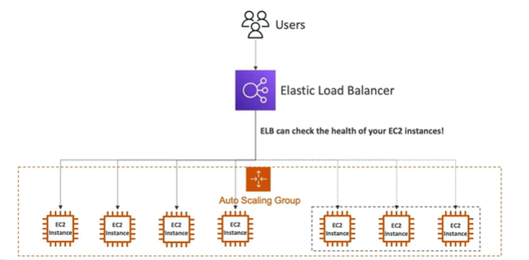

# What is an Auto Scaling Group?

- In real-life, the load on your websites and applications can change
- In the cloud, you can create and get rid of servers very quickly

- The goal of an Auto Scaling Group (ASG) is to:
    - Scale out (add EC2 instances) to match an increased load
    - Scale in (remove EC2 instances) to match a decreased load
    - Ensure we have a minimum and a maximum number of machines running
    - Automatically register new instances to a load balancer
    - Replace unhealthy instances
    - ASG makes use of Launch Configurations or Launch Templates. Launch templates contain
        - AMI + Instance Type
        - EC2 user data
        - EBS Volumes
        - Security Groups
        - SSH Key Pair
        - IAM Roles for your EC2 Instances
        - Network Settings

- ASG are free. You pay for the underlying resources being launched

## Auto Scaling in AWS

Auto Scaling Group (ASG) are behind a load balancer

    - 

## References

https://tutorialsdojo.com/aws-auto-scaling/

https://docs.aws.amazon.com/autoscaling/ec2/userguide/as-scaling-target-tracking.html

https://docs.aws.amazon.com/autoscaling/ec2/userguide/AutoScalingGroup.html

Scale in and out:

https://docs.aws.amazon.com/autoscaling/ec2/userguide/as-instance-termination.html#default-termination-policy

https://docs.aws.amazon.com/autoscaling/ec2/userguide/as-instance-termination.html
