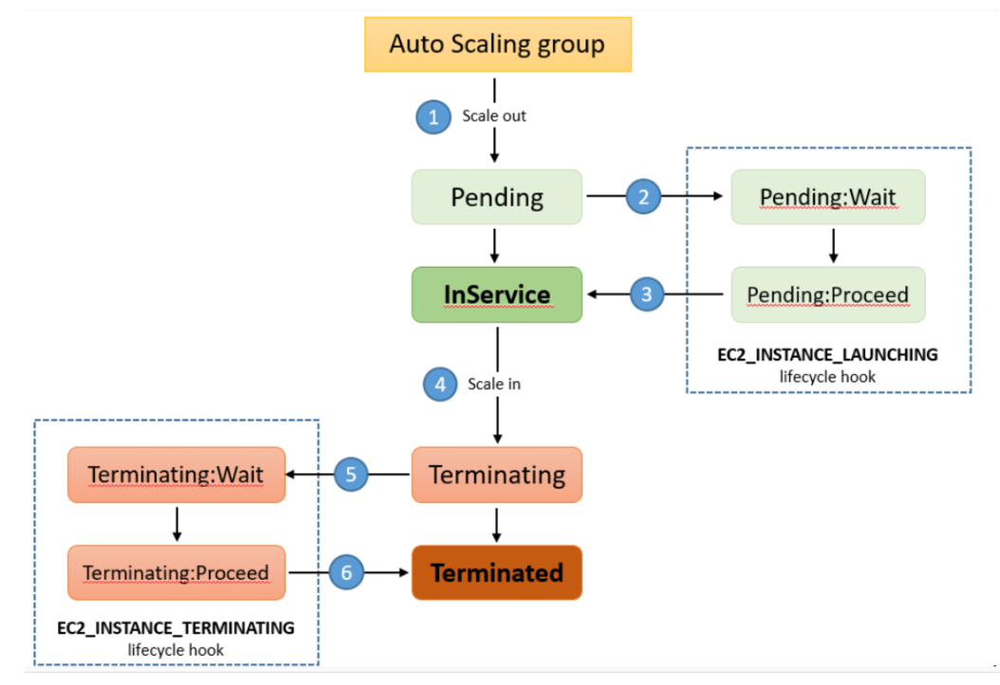

# EC2 Auto Scaling Lifecycle Hooks

- Lifecycle hooks enable you to perform custom actions by pausing instances as an Auto Scaling group launches or terminates them.
- Examples include:
    - Waiting for your EC2 user data to run before accepting traffic
    - Waiting for the the latest code based from your source control system to be installed before accepting traffic

Scale out:
- The instance stays in the Pending:Wait state until the hook completes or the timeout period ends, whichever happens first.
- You can call "complete-lifecycle-action" to complete the lifecycle action or you can wait 3600 seconds (1 hour) for the instance to enter the InService state.

Scale in:
- The instance stays in the Terminating:Wait state until the hook completes or the timeout period ends, whichever happens first.
- For example, you cans set a timeout of 2 minutes for the instance to shut down cleanly, or upload a file to S3. If the instance does not shut down cleanly within 2 minutes, Amazon EC2 Auto Scaling terminates it.

## References

https://tutorialsdojo.com/amazon-ec2-auto-scaling-lifecycle-hooks/

